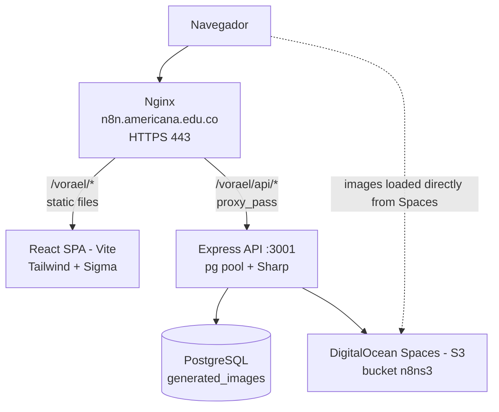
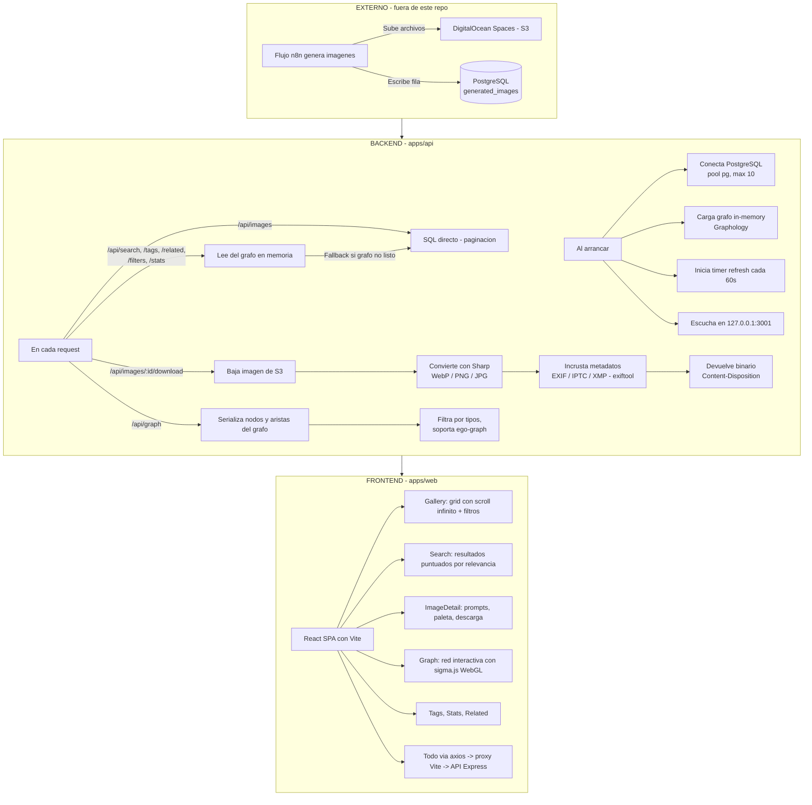
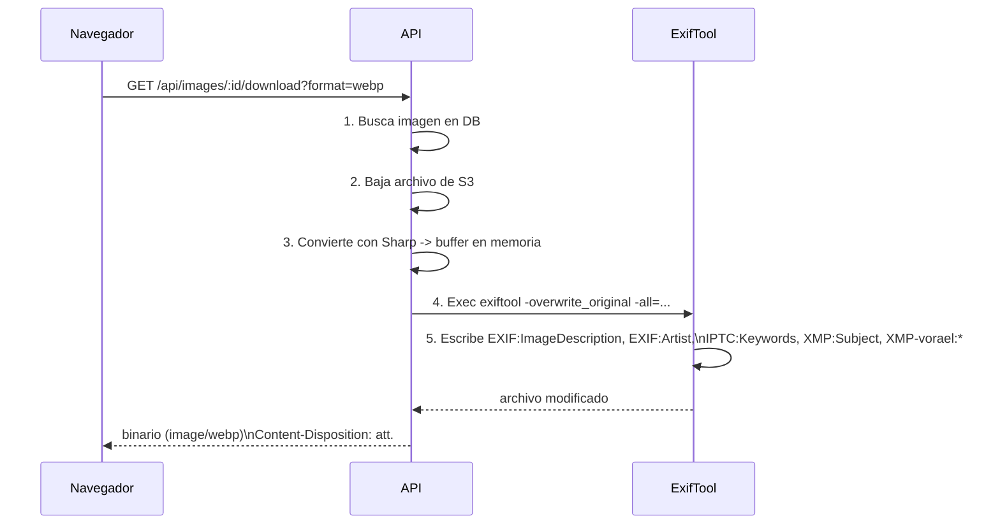

# VORAEL — Documentación Técnica

Catálogo de imágenes generadas por IA de la Corporación Universitaria Americana.
Sistema de solo lectura: no genera imágenes ni las sube. Lee una tabla de
PostgreSQL que llena un flujo externo de n8n, y sirve archivos almacenados en
DigitalOcean Spaces.

Producción: **https://n8n.americana.edu.co/vorael/**

---

## 1. Stack tecnológico

### Backend (`apps/api`)

| Componente | Tecnología | Versión | Propósito |
|---|---|---|---|
| Runtime | Node.js | ≥ 20 | Ejecución del API |
| Framework | Express | 4.x | HTTP server, routing, middleware |
| Lenguaje | TypeScript | 5.x | Type safety, CommonJS modules |
| Base de datos | PostgreSQL | — | Tabla `generated_images` (solo lectura) |
| Cliente DB | pg (node-postgres) | — | Pool de conexiones (máx. 10) |
| Objeto storage | DigitalOcean Spaces (S3) | AWS SDK v3 | Bajar/convertir imágenes |
| Procesamiento de imagen | Sharp | — | Conversión WebP/PNG/JPG, redimensión |
| Motor de grafos | Graphology | 0.26.x | Grafo in-memory para búsqueda y relaciones |
| Incrustación de metadatos | ExifTool (binario) | — | Leer/escribir EXIF, IPTC, XMP |
| Testing | Vitest | 4.x | Unit + integration tests |
| Benchmark | Custom script | — | Comparación SQL vs grafo |

### Frontend (`apps/web`)

| Componente | Tecnología | Versión | Propósito |
|---|---|---|---|
| Framework | React | 18.x | UI declarativa |
| Bundler | Vite | 5.x | Dev server, HMR, build optimizado |
| Lenguaje | TypeScript | 5.x | Type safety |
| Estilos | Tailwind CSS | 3.x | Utility-first CSS |
| Data fetching | TanStack Query | 5.x | Cache, revalidación, infinite scroll |
| Animaciones | Framer Motion | — | Transiciones suaves |
| Iconos | lucide-react | — | Iconografía ligera |
| Grafo interactivo | Sigma.js | 3.x | Renderizado WebGL de grafos |
| Grafo (datoss) | Graphology | 0.26.x | Estructura de datos para sigma |
| HTTP client | Axios | — | Requests con timeout, interceptores |
| Routing | React Router | 6.x | SPA routing con basename |

### Herramientas de desarrollo

| Herramienta | Propósito |
|---|---|
| pnpm | Gestor de paquetes, workspaces monorepo |
| ts-node-dev | Hot-reload del API en desarrollo |
| Vitest | Tests con cobertura |
| Supertest | Tests de endpoints HTTP |
| ExifTool | Manipulación de metadatos en imágenes |

---

## 2. Arquitectura del sistema

### 2.1 Diagrama de componentes



### 2.2 Flujo de datos



### 2.3 Flujo de una descarga con metadatos



---

## 3. Sistema de metadatos incrustados

### 3.1 Concepto

Cada imagen puede llevar metadatos incrustados en sus cabeceras EXIF, IPTC y XMP.
Esto es equivalente al frontmatter YAML de Obsidian: datos estructurados que
viven dentro del propio archivo y que cualquier herramienta de metadatos puede
leer (Adobe Bridge, Lightroom, ExifTool, etc.).

### 3.2 Namespace XMP-vorael (metadatos propios)

Definido en [`.ExifTool_config`](apps/api/.ExifTool_config), es un namespace XMP
personalizado que almacena los campos específicos de VORAEL:

| Campo XMP | Tipo | Descripción | Ejemplo |
|---|---|---|---|
| `vorael:id` | string | ID de la imagen en PostgreSQL | `img-001` |
| `vorael:style` | string | Estilo artístico | `Photorealistic` |
| `vorael:mood` | string | Estado emocional | `Calm` |
| `vorael:useCase` | string | Caso de uso sugerido | `Wallpaper` |
| `vorael:palette` | string | Paleta de colores (hex, coma-separado) | `#FFD700, #8B4513` |
| `vorael:fileName` | string | Nombre original del archivo | `cat-sunset.webp` |
| `vorael:createdAt` | string | Timestamp ISO 8601 | `2026-01-15T10:30:00Z` |

### 3.3 Campos estándar (compatibilidad universal)

Además del namespace propio, se incrustan campos que cualquier herramienta entiende:

| Campo estándar | Origen | Uso |
|---|---|---|
| `EXIF:ImageDescription` | enhanced_prompt (fallback: original_prompt) | Descripción de la imagen |
| `EXIF:Artist` | Literal: "Corporación Universitaria Americana - VORAEL" | Autor |
| `IPTC:Keywords` | tags (uno por keyword) | Palabras clave para búsqueda |
| `XMP:Subject` | subject | Título/asunto de la imagen |
| `XMP:Title` | subject | Título visible en herramientas |

### 3.4 Flujo de incrustación (embed)

Cuando se descarga una imagen (`/api/images/:id/download`):

1. **Sharp convierte** el buffer original al formato solicitado (WebP lossless,
   PNG sin compresión, JPG al 100%).
2. **Se ejecuta exiftool** con el flag `-overwrite_original` para modificar el
   buffer en memoria.
3. **Se escriben** los campos estándar (EXIF, IPTC, XMP) y el namespace
   `XMP-vorael:*` con todos los metadatos de la imagen.
4. **Si exiftool falla** o no está instalado, la imagen se entrega sin metadatos
   (degradación silenciosa, sin error al usuario).
5. **Si el modo es mock** (DB_MOCK=true), se lee el archivo local de `test-images/`
   en lugar de S3.

### 3.5 Flujo de lectura (read)

El sistema puede leer metadatos de imágenes existentes:

1. **ExifTool** extrae todos los campos XMP/EXIF/IPTC del buffer.
2. **Se parsea** el namespace `XMP-vorael:*` para obtener los campos propios.
3. **Se retornan** tanto los campos estándar (description, artist, tags) como los
   campos custom (style, mood, useCase, palette, id, fileName, createdAt).
4. **Si no hay metadatos vorael**, `hasVoraelMeta: false` y campos vacíos.

### 3.6 Scripts de gestión de metadatos

| Script | Comando | Qué hace |
|---|---|---|
| `export-portable.ts` | `pnpm export-portable` | Exporta imágenes de S3 a carpeta local `export-vorael/` con metadatos incrustados. **Solo lectura** (no modifica S3). |
| `backfill.ts` | `pnpm backfill` | Reescribe archivos en S3 con metadatos incrustados. **Requiere** `ALLOW_BACKFILL_WRITE=true` y probe de PutObject exitoso. |
| `scanner.ts` | `pnpm scan` | Reconstruye el grafo in-memory desde archivos de imagen (recovery mode). Soporta `--mock` para testing. |

### 3.7 Degradación y robustez

- Si **exiftool no está instalado**: las imágenes se sirven sin metadatos.
  Ningún endpoint falla. El sistema detecta exiftool al arrancar y cachea el
  resultado.
- Si **exiftool falla** durante la incrustación: se entrega la imagen original
   sin metadatos. Se loguea el error.
- Si **no hay metadatos vorael** en una imagen: `readImageMetadata` retorna
  `hasVoraelMeta: false` y campos estándar vacíos.
- Si **el modo es mock**: se usan archivos locales de `test-images/` (placeholders
  generados con Sharp), sin dependencia de S3 ni PostgreSQL.

---

## 4. Motor de búsqueda por grafos

### 4.1 Concepto

Las rutas de búsqueda, tags, filtros, stats y related leen de un grafo en memoria
(Graphology) sincronizado con PostgreSQL cada 60 segundos. Esto permite:
- **Búsqueda por token-match** con scoring por relevancia
- **Relaciones multihop** para imágenes relacionadas
- **Co-ocurrencia de tags** para descubrimiento
- **Exploración visual** vía grafo interactivo (sigma.js)

### 4.2 Estructura del grafo

**Nodos:**

| Tipo | Ejemplo | Color | Fuente |
|---|---|---|---|
| `image` | `img-001` | `#6366f1` (indigo) | `id` de la imagen |
| `tag` | `tag:cat` | `#f59e0b` (amber) | Cada tag del array `tags` |
| `style` | `style:Photorealistic` | `#22c55e` (green) | Campo `style` |
| `mood` | `mood:Calm` | `#a855f7` (purple) | Campo `mood` |
| `useCase` | `ucase:Wallpaper` | `#06b6d4` (cyan) | Campo `use_case` |
| `color` | `color:#FFD700` | `#6b7280` (gray) | Cada color de `color_palette` |

**Aristas:**

| Tipo | Dirección | Descripción |
|---|---|---|
| `TAGGED_WITH` | Image → Tag | Imagen tiene tag |
| `HAS_STYLE` | Image → Style | Imagen tiene estilo |
| `HAS_MOOD` | Image → Mood | Imagen tiene mood |
| `HAS_USECASE` | Image → UseCase | Imagen tiene caso de uso |
| `HAS_COLOR` | Image → Color | Imagen usa color |
| `CO_OCCURS_WITH` | Tag → Tag | Dos tags aparecen juntos (peso = frecuencia) |

### 4.3 Índices de apoyo

Además de Graphology, el motor mantiene:

- `Map<id, ImageRow>` — acceso rápido a fila completa para servir items
- `Map<dimension, Set<id>>` — invertido por tag/style/mood/use_case/color
- Texto tokenizado por imagen (minúsculas, frontera de palabra + plural mínimo)
- Lista global ordenada `(created_at DESC, id DESC)` — paginado determinista

### 4.4 Sincronización

- **Arranque:** carga completa de `generated_images`.
- **Periodicidad:** timer cada `GRAPH_REFRESH_MS` (def. 60s) compara watermark
  barato (`MAX(created_at)`, `COUNT`). Si cambió → rebuild completo + atomic
  swap. Nunca se ve un grafo a medias.
- **Fallback:** mientras no esté listo o ante rebuild fallido, las rutas migradas
  sirven desde SQL. Se conserva el último snapshot válido.

### 4.5 Búsqueda con token-match

Cada término de la query debe aparecer como **palabra completa** en
`subject`/`original_prompt`/`enhanced_prompt` (no como subcadena `%q%` que pegaba
en "categoría"). Tags siguen siendo overlap exacto (array).

| Coincidencia | Puntos |
|---|---|
| cada tag que solapa (`tags && terms`) | 3 |
| `subject` contiene el término | 2 |
| `original_prompt` contiene el término | 1 |
| `enhanced_prompt` contiene el término | 1 |

Orden: `score DESC, created_at DESC, id DESC`.

### 4.6 Related (recomendaciones)

El motor de grafo calcula similitud multihop:
1. Intersección de vecinos compartidos (Jaccard simplificado sobre tags, style,
   mood, use_case, color).
2. Bonus por co-ocurrencia fuerte entre tags (`CO_OCCURS_WITH` con peso > 0).
3. Excluye la imagen de origen.

### 4.7 Variables de entorno

| Variable | Defecto | Uso |
|---|---|---|
| `GRAPH_REFRESH_MS` | `60000` | Intervalo de refresh del grafo (ms) |
| `SEARCH_ENGINE` | `graph` | `graph` (motor en memoria) o `sql` (rollback) |
| `METADATA_EMBED` | `none` | `exiftool` (incrustar EXIF/IPTC) o `none` |
| `DB_MOCK` | `false` | `true` para modo mock (sin PostgreSQL/S3) |

---

## 5. Vista de grafo interactivo (`/vorael/graph`)

### 5.1 Endpoint API

`GET /api/graph` serializa el grafo en memoria para visualización.

**Parámetros:**

| Param | Tipo | Defecto | Descripción |
|---|---|---|---|
| `types` | string | todos | Filtro por tipo: `image,tag,style,mood,useCase,color` (coma-separado) |
| `limit` | number | 200 | Máximo de nodos (máx. 500) |
| `center` | string | — | ID de nodo para ego-graph (vecindario) |
| `hops` | number | 1 | Profundidad de vecindario (1-3) |

**Respuesta:**

```typescript
interface GraphExport {
  nodes: GraphNode[];
  edges: GraphEdge[];
}

interface GraphNode {
  id: string;           // "img-001", "tag:cat", "style:Photorealistic"
  type: 'image' | 'tag' | 'style' | 'mood' | 'useCase' | 'color';
  label: string;        // nombre legible
  size: number;         // grado/conteo (para tamaño visual)
  color: string;        // hex por tipo
}

interface GraphEdge {
  source: string;
  target: string;
  type: string;         // "TAGGED_WITH", "HAS_STYLE", "CO_OCCURS_WITH", etc.
  weight: number;
}
```

### 5.2 Frontend (Sigma.js)

- **Renderizado WebGL** via Sigma.js 3 + Graphology
- **Layout force-directed** (simulación en el cliente)
- **Toggle de tipos** para mostrar/ocultar nodos por categoría
- **Click en nodo** para navegar al detalle (imágenes) o filtrar (tags/styles)
- **Vecindario** al hacer click: resalta conexiones directas
- **Estadísticas** en tiempo real: nodos/arestas visibles
- **Responsive** se adapta al tamaño del contenedor

### 5.3 Colores de nodos

| Tipo | Color | Hex |
|---|---|---|
| Imagen | Indigo | `#6366f1` |
| Tag | Ámbar | `#f59e0b` |
| Style | Verde | `#22c55e` |
| Mood | Púrpura | `#a855f7` |
| UseCase | Cian | `#06b6d4` |
| Color | Gris | `#6b7280` |

---

## 6. Endpoints del API

### 6.1 Tabla de endpoints

| Método y ruta | Query params | Respuesta |
|---|---|---|
| `GET /api/health` | — | `{ ok: true, ts: string }` |
| `GET /api/images` | `page` (def. 1), `limit` (máx. 100, def. 24), `style`, `mood`, `use_case` | `{ items: Image[], page, limit, total, hasMore }` |
| `GET /api/images/:id` | — | `Image` o `{ error: "Image not found" }` (404) |
| `GET /api/images/:id/download` | `format=webp\|png\|jpg` (def. `webp`) | Binario (Content-Type: image/...) o `{ error }` |
| `GET /api/images/:id/related` | `limit` (máx. 24, def. 8) | `{ items: Image[] }` |
| `GET /api/search` | `q`, `page`, `limit` | `{ items: Image[], page, limit, total, hasMore, q }` |
| `GET /api/tags` | `limit` (máx. 500, def. 200) | `{ items: TagWithCount[] }` |
| `GET /api/tags/:tag/images` | `page`, `limit` | `{ items: Image[], page, limit, total, hasMore, tag }` |
| `GET /api/filters` | — | `{ styles: FilterValue[], moods: FilterValue[], useCases: FilterValue[] }` |
| `GET /api/stats` | — | `{ total, topStyles: FilterValue[], topMoods: FilterValue[], topTags: TagWithCount[] }` |
| `GET /api/graph` | `types`, `limit`, `center`, `hops` | `{ nodes: GraphNode[], edges: GraphEdge[] }` |

### 6.2 Forma de los tipos

```typescript
interface Image {
  id: string;
  s3_key: string;
  s3_url: string;
  original_prompt: string | null;
  enhanced_prompt: string | null;
  tags: string[] | null;
  style: string | null;
  subject: string | null;
  mood: string | null;
  color_palette: string[] | null;
  use_case: string | null;
  filename: string | null;
  created_at: string;
}

interface FilterValue {
  value: string;
  count: number;
}

interface TagWithCount {
  tag: string;
  count: number;
}
```

### 6.3 Manejo de errores

Cada ruta hace `next(err)` y un handler central responde 500 con
`{ error: string }`. Ruta sin match devuelve 404 con `{ error, path }`.

Errores conocidos:
- `/api/images/:id` — 404 si el id no existe
- `/api/images/:id/download` — 404 si no existe, 500 si no tiene `s3_key`
- `/api/images/:id/related` — 200 con `items: []` si el id no existe
- `/api/search` — 200 con `items: []` y `total: 0` si `q` está vacío
- `/api/tags/:tag/images` — 200 con `items: []` si el tag no existe

No hay errores 400/422: los parámetros inválidos se ignoran o se corrigen
(`page < 1` → 1, `limit > 100` → 100, `format` no válido → `webp`).

---

## 7. Frontend

### 7.1 Rutas

Definidas en [App.tsx](apps/web/src/App.tsx), todas dentro de un Layout común:

| Ruta | Página | Qué hace |
|---|---|---|
| `/` | Gallery | Grid con scroll infinito + panel de filtros |
| `/search?q=…` | Search | Resultados puntuados, scroll infinito |
| `/image/:id` | ImageDetail | Imagen grande, prompts, paleta, tags, descarga, relacionadas |
| `/tags` | Tags | Todos los tags como chips |
| `/tag/:tag` | TagPage | Grid filtrado por un tag |
| `/stats` | Stats | Totales y rankings |
| `/graph` | Graph | Red interactiva con sigma.js (WebGL) |
| `*` | NotFound | 404 del cliente |

### 7.2 Data fetching

- **Instancia axios** en `services/api.ts` con timeout 20s (120s para downloads)
- **TanStack Query** con staleTime 30s, gcTime 5min, 1 reintento
- **Infinite scroll** con IntersectionObserver (rootMargin 600px)
- **Debounce** 300ms en el buscador

### 7.3 Diseño

Tema oscuro fijo (`color-scheme: dark`):
- **Paleta:** canvas (fondos), accent (violeta `#7c5cff`), ink (texto)
- **Tipografías:** Syne (display), DM Sans (texto), JetBrains Mono (prompts)
- **Componentes:** `.chip`, `.btn-primary`, `.btn-ghost`, `.skeleton`, `.glass`

---

## 8. Variables de entorno

### `apps/api/.env`

| Variable | Defecto | Para qué |
|---|---|---|
| `DB_HOST` `DB_PORT` `DB_NAME` `DB_USER` `DB_PASSWORD` | — / `5432` | Conexión a PostgreSQL |
| `DB_SSL` | `false` | `true` fuerza TLS |
| `S3_ENDPOINT` | — | Host de Spaces (sin bucket) |
| `S3_BUCKET` `S3_ACCESS_KEY` `S3_SECRET_KEY` | — | Bucket y credenciales |
| `S3_REGION` | `us-east-1` | En producción: `sfo3` |
| `PORT` | `3001` | Puerto de Express |
| `HOST` | `127.0.0.1` | Loopback detrás de Nginx |
| `CORS_ORIGIN` | `*` | Orígenes permitidos |
| `DB_MOCK` | `false` | Modo mock (sin DB/S3) |
| `SEARCH_ENGINE` | `graph` | Motor de búsqueda |
| `GRAPH_REFRESH_MS` | `60000` | Intervalo de refresh |
| `METADATA_EMBED` | `none` | `exiftool` para incrustar metadatos |
| `ALLOW_BACKFILL_WRITE` | `false` | Permitir escritura en S3 |

> **Nota local:** el `.env` real está gitignored. Para desarrollo local se usa
> Docker (`docker-compose.yml`, Postgres en puerto **5433**) y se copia
> `.env.example` a `.env` completando las credenciales. Las imágenes mock se
> cargan con `pnpm seed:db`.

### `apps/web/.env`

| Variable | Dev | Producción |
|---|---|---|
| `VITE_API_URL` | vacío (proxy de Vite) | `/vorael` |
| `VITE_BASE_PATH` | `/vorael/` | `/vorael/` |
| `VITE_DEV_API_PROXY` | `http://localhost:3001` | — |

---

## 9. Estructura del repositorio

```mermaid
flowchart TD
    ROOT[vorael/] --> ARQ[ARQUITECTURA.md\ndocumento]
    ROOT --> DEPLOY[DEPLOY.md\ndespliegue paso a paso]
    ROOT --> README[README.md\narranque rapido]
    ROOT --> DC[docker-compose.yml\nPostgres local puerto 5433]
    ROOT --> PKG[package.json\nscripts del monorepo]
    ROOT --> WS[pnpm-workspace.yaml\nworkspaces: apps/*]

    ROOT --> DOCS[docs/]
    DOCS --> PLAN[PLAN_GRAFOS.md\ndecisiones de diseno del motor de grafos]
    DOCS --> GUIA[VORAEL_GUIA_COMPLETA.md\nguia completa dummies-friendly]

    ROOT --> APPS[apps/]

    APPS --> API[api/\nExpress + Postgres + S3 + Graphology]
    API --> EXIFCFG[.ExifTool_config\nnamespace XMP-vorael]
    API --> ENV[.env.example\nplantilla local gitignored real .env]
    API --> ENVP[.env.production.example\nplantilla para servidor]
    API --> TEST[test/\nsuites de test Vitest 98 tests]
    API --> BENCH[bench/\nbenchmark SQL vs grafo]
    API --> TESTIMG[test-images/\nplaceholders mock Sharp 10 archivos]
    API --> TESTREAL[test-images-real/\nimagenes descargadas de S3 simulacion local ~45MB untracked]
    API --> SRC[src/]
    SRC --> INDEX[index.ts\napp middleware montaje de rutas]
    SRC --> CONFIG[config.ts\nlectura de .env]
    SRC --> DB[db.ts\npool de pg + modo mock]
    SRC --> S3FILE[s3.ts\ncliente de Spaces + presign]
    SRC --> GRAPH[graph.ts\nmotor de grafos Graphology + export]
    SRC --> METADATA[metadata.ts\nincrustacion / lectura EXIF IPTC XMP]
    SRC --> MOCK[mockData.ts\ndatos mock 30 imagenes]
    SRC --> TYPES[types.ts\nforma de la fila]
    SRC --> ROUTES[routes/\nimages search tags filters stats graph]
    SRC --> SCRIPTS[scripts/]
    SCRIPTS --> EXP[export-portable.ts\nexport local con metadatos]
    SCRIPTS --> BACK[backfill.ts\nre-escritura en S3]
    SCRIPTS --> SCAN[scanner.ts\nreconstruccion desde archivos]
    SCRIPTS --> SEED[seed-db.ts\nseed local con datos mock 30 imgs]
    SCRIPTS --> SIM[simulate-local.ts\ndescarga de S3 + incrustacion + DB local]

    APPS --> WEB[web/\nSPA React]
    WEB --> MAIN[main.tsx\nproviders y BrowserRouter]
    WEB --> APPFILE[App.tsx\nrutas]
    WEB --> PAGES[pages/\nuna por ruta Gallery Search Graph ...]
    WEB --> COMPONENTS[components/\nlayout features ui]
    WEB --> HOOKS[hooks/\ndatos scroll infinito debounce]
    WEB --> SERVICES[services/\ncliente axios + tipos API]
    WEB --> WTYPES[types/\ntipos compartidos con el API]

    ROOT --> DEPLOYDIR[deploy/]
    DEPLOYDIR --> NGINX[nginx-vorael.conf\nbloques location para Nginx]
    DEPLOYDIR --> SYSTEMD[vorael-api.service\nunidad systemd]
    DEPLOYDIR --> INITSQL[init.sql\nesquema PostgreSQL montado por Docker]
    DEPLOYDIR --> BUILD[build-release.sh\nempaquetado de release]
```



---

## 10. Notas de implementación

- **`trust proxy`** — activado, para que `req.ip` y `req.protocol` reflejen las
  cabeceras `X-Forwarded-*` de Nginx.
- **Config tolerante** — `config.ts` avisa pero no aborta si falta una variable.
  El proceso arranca y `/api/health` responde aunque Postgres esté mal.
- **`limit`/`offset` interpolados** — van directo al SQL, no como parámetros.
  Son seguros porque pasan por `Number()` + `Math.min/max`. Los valores de
  usuario sí van parametrizados.
- **Auto-start** — `index.ts` solo hace `app.listen` cuando se ejecuta directo
  (`require.main === module`).
- **sharp trae binarios nativos** por plataforma. No se puede copiar
  `node_modules` de Windows al servidor Linux.
- **El puerto 3001 no debe abrirse en el firewall.** `HOST=127.0.0.1` y todo
  entra por Nginx.
- **La sub-ruta `/vorael/`** toca 4 sitios: vite.config.ts (base), main.tsx
  (basename), nginx-vorael.conf (location), index.html (favicon href).
