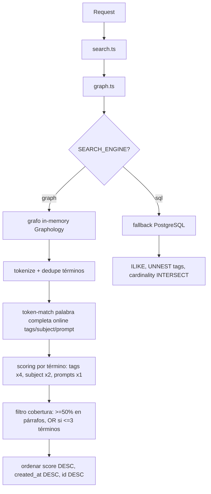
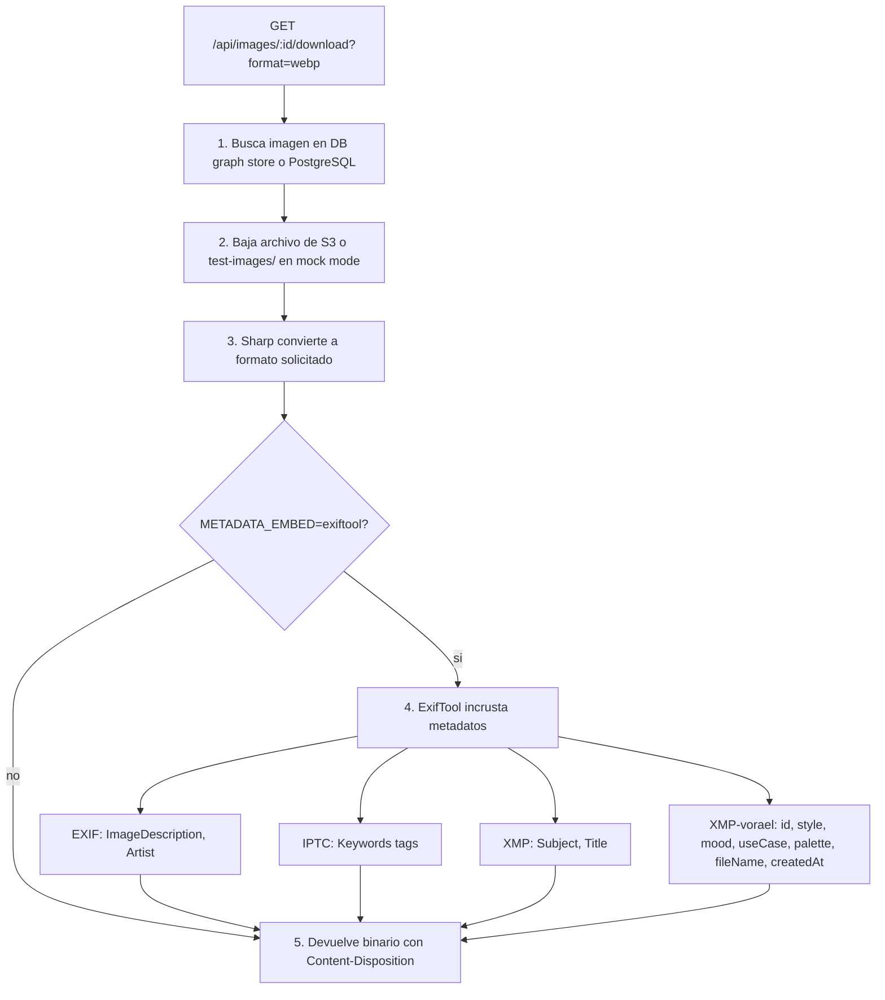
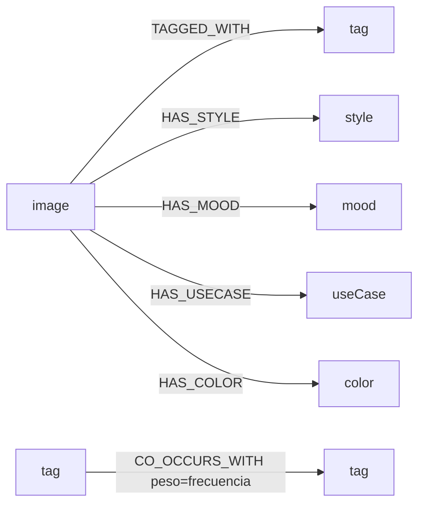

# VORAEL — Cheatsheet del API

## Ruta rápida

```
vorael/
├── apps/api/src/
│   ├── index.ts              ← Entry point: Express, middleware, rutas
│   ├── config.ts             ← Lee .env, exporta config.*
│   ├── db.ts                 ← Pool PostgreSQL + mock-aware query()
│   ├── s3.ts                 ← Cliente DigitalOcean Spaces (S3)
│   ├── graph.ts              ← Motor de grafos (Graphology, in-memory)
│   ├── metadata.ts           ← ExifTool: embed + readImageMetadata
│   ├── mockData.ts           ← 30 imágenes mock (MOCK_IMAGES)
│   ├── types.ts              ← ImageRow y tipos compartidos
│   ├── routes/
│   │   ├── images.ts         ← /api/images, /api/images/:id, /download, /related
│   │   ├── search.ts         ← /api/search?q=... (token-match + scoring)
│   │   ├── tags.ts           ← /api/tags, /api/tags/:tag/images
│   │   ├── filters.ts        ← /api/filters (estilos, moods, usos)
│   │   ├── stats.ts          ← /api/stats (totales y rankings)
│   │   └── graph.ts          ← /api/graph (nodos + aristas para sigma.js)
│   └── scripts/
│       ├── seed-db.ts        ← Carga 30 mock images a PostgreSQL
│       ├── simulate-local.ts ← Descarga de S3 + embed + DB local
│       ├── backfill.ts       ← Reescribe archivos en S3 con metadatos
│       ├── export-portable.ts← Exporta imágenes con metadatos a disco
│       └── scanner.ts        ← Reconstruye grafo desde archivos
```

## Endpoints — tabla rápida

| Ruta | Qué hace | Archivo |
|---|---|---|
| `GET /api/health` | Estado del sistema | `index.ts:31` |
| `GET /api/images` | Grid paginado (page, limit, style, mood, use_case) | `routes/images.ts` |
| `GET /api/images/:id` | Detalle de una imagen | `routes/images.ts` |
| `GET /api/images/:id/download` | Descarga (format=webp\|png\|jpg, embed metadatos) | `routes/images.ts` |
| `GET /api/images/:id/related` | Imágenes relacionadas (vecinos compartidos en grafo) | `routes/images.ts` |
| `GET /api/search?q=...` | Búsqueda por token-match + scoring (tags×3, subject×2, prompts×1) | `routes/search.ts` |
| `GET /api/tags` | Todos los tags con conteo | `routes/tags.ts` |
| `GET /api/tags/:tag/images` | Imágenes por tag específico | `routes/tags.ts` |
| `GET /api/filters` | Estilos, moods y usos disponibles | `routes/filters.ts` |
| `GET /api/stats` | Totales, top estilos, top moods, top tags | `routes/stats.ts` |
| `GET /api/graph` | Grafo completo (types, limit, center, hops) para sigma.js | `routes/graph.ts` |

## Flujo del motor de búsqueda



> **Cómo busca**: cada palabra vale puntos según donde aparezca (tag +4, subject +2, prompt +1). Un término puede coincidir en varios campos y cuenta como un match. En queries de 1-3 términos basta un match (OR); en párrafos se exige ≥50% de los términos únicos.

## Flujo de descarga con metadatos



## Motor de grafos — nodos y aristas



## Modos de operación

| Variable | Valor | Qué pasa |
|---|---|---|
| `DB_MOCK=true` | Mock | 30 imágenes de `mockData.ts`, 10 .webp en `test-images/`. Sin DB, sin S3 |
| `DB_MOCK=false` | Real | PostgreSQL + S3. Requiere Docker o DB real |
| `SEARCH_ENGINE=graph` | Grafo | In-memory Graphology, refresh cada 60s |
| `SEARCH_ENGINE=sql` | SQL | Fallback PostgreSQL directo |
| `METADATA_EMBED=exiftool` | Embed | Incrusta EXIF/IPTC/XMP en descargas |
| `METADATA_EMBED=none` | No embed | Sin metadatos en archivos |

## Desarrollo local

```bash
# 1. Postgres Docker (puerto 5433)
sudo docker compose up -d

# 2. Cargar datos mock a PostgreSQL
cd apps/api && pnpm seed:db

# 3. Arrancar API + web
cd ../.. && pnpm dev

# URLs
# Galería:  http://localhost:5173/vorael/
# Grafo:    http://localhost:5173/vorael/graph
# Search:   http://localhost:5173/vorael/search?q=cat
# Tags:     http://localhost:5173/vorael/tags
# Stats:    http://localhost:5173/vorael/stats
```

## Tests

```bash
pnpm test                    # 94 tests (excluye metadata.test.ts)
npx vitest run               # todos (96/98, 2 fallos pre-existente en metadata)
npx vitest run test/routes.test.ts   # un archivo específico
```

## Variables de entorno — las más usadas

| Variable | Defecto | Descripción |
|---|---|---|
| `DB_MOCK` | `false` | Modo mock (sin DB/S3) |
| `SEARCH_ENGINE` | `graph` | Motor: `graph` o `sql` |
| `METADATA_EMBED` | `none` | `exiftool` o `none` |
| `DB_HOST` / `DB_PORT` | — / `5432` | PostgreSQL. Docker local: `localhost:5433` |
| `S3_ENDPOINT` | — | `https://sfo3.digitaloceanspaces.com` |
| `PORT` | `3001` | Puerto Express |
| `HOST` | `127.0.0.1` | Loopback (no exponer) |
