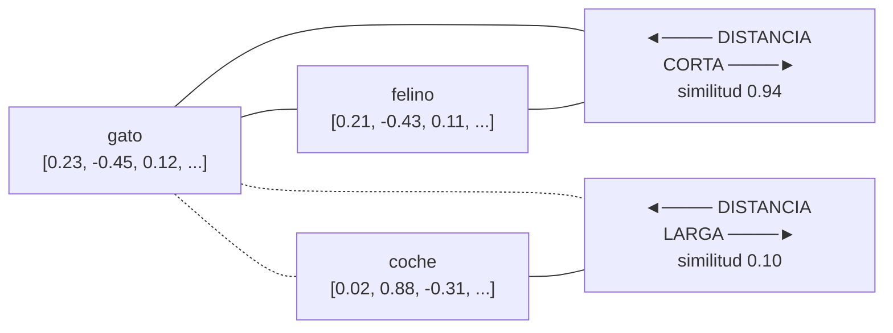
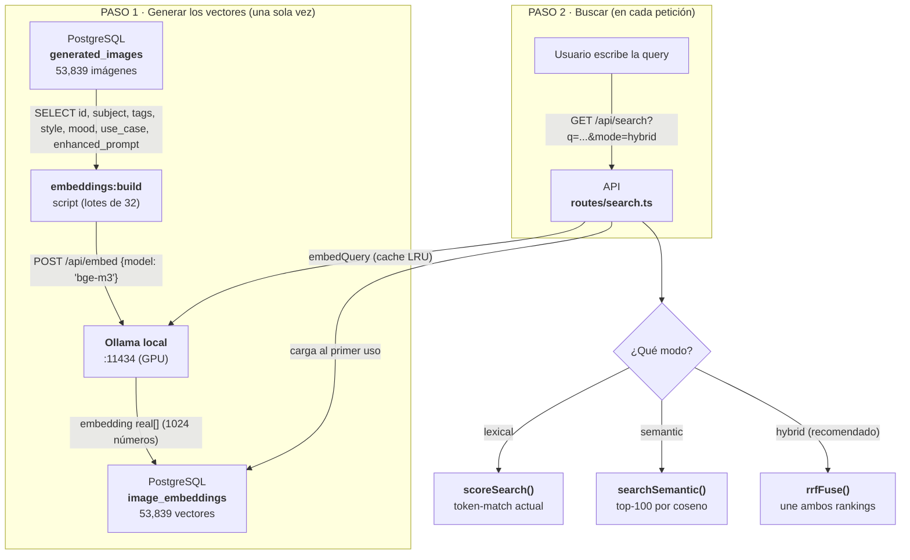
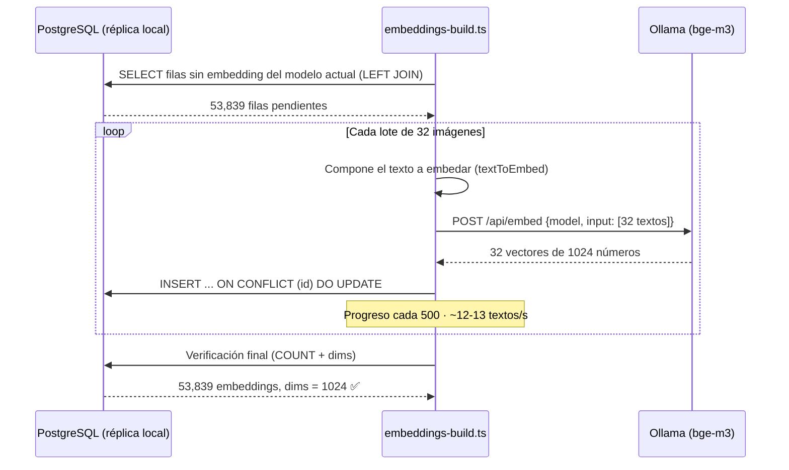
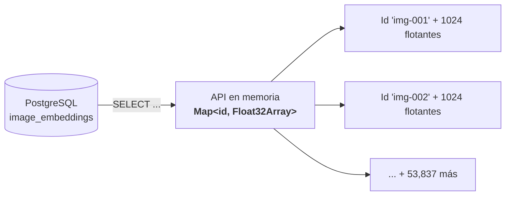
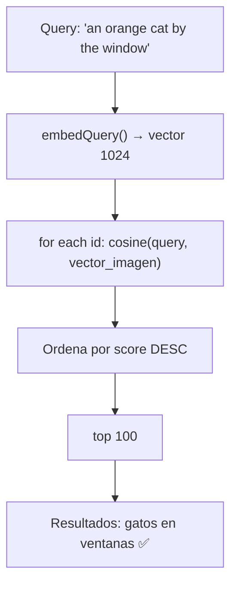
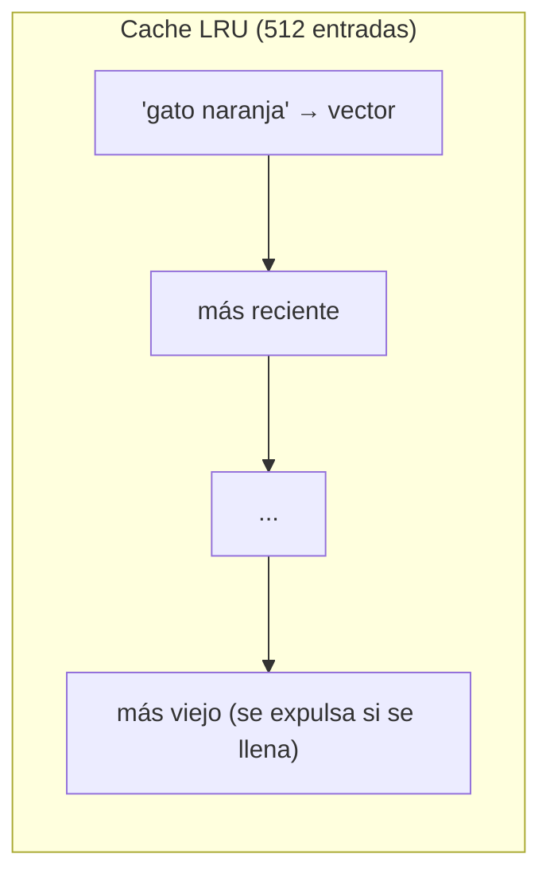
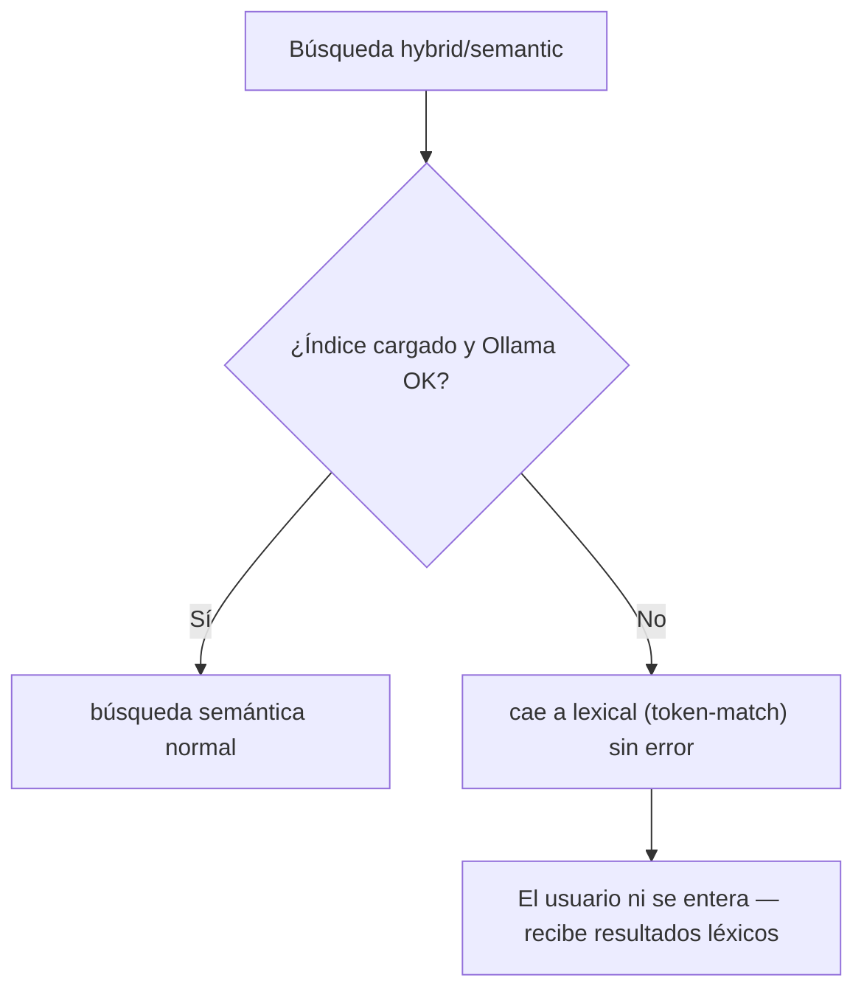
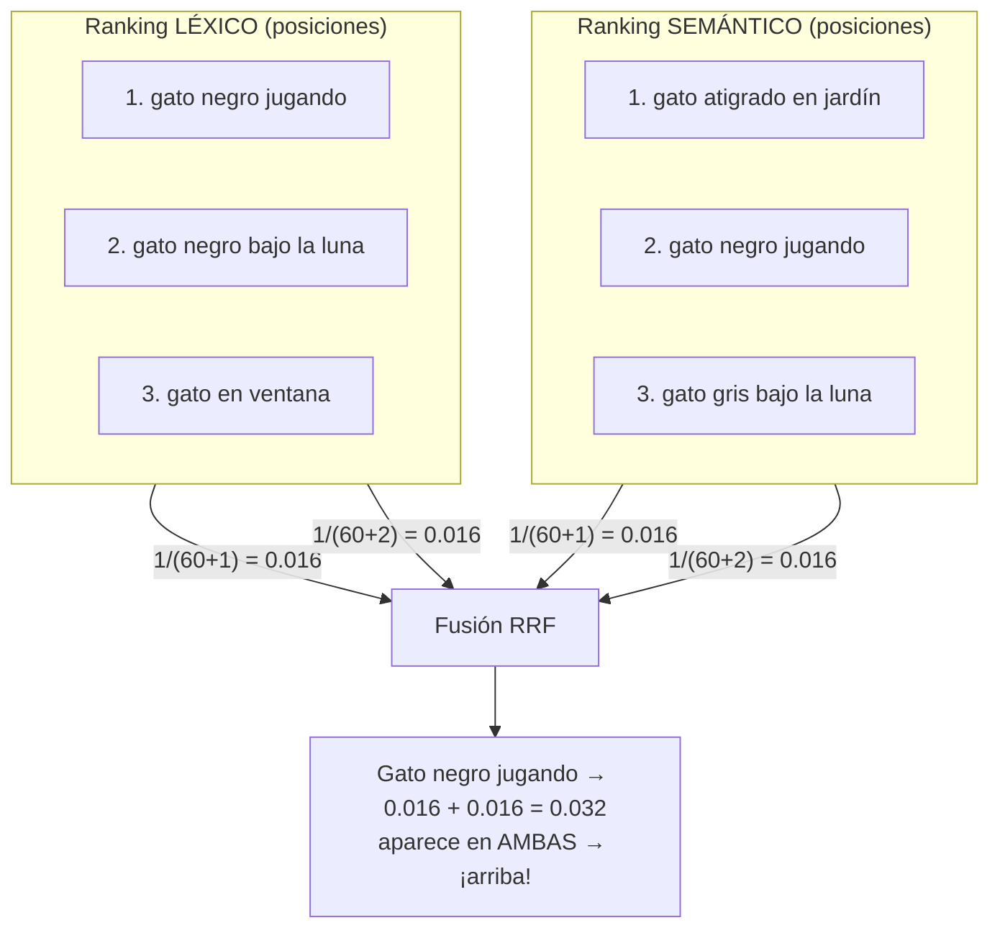
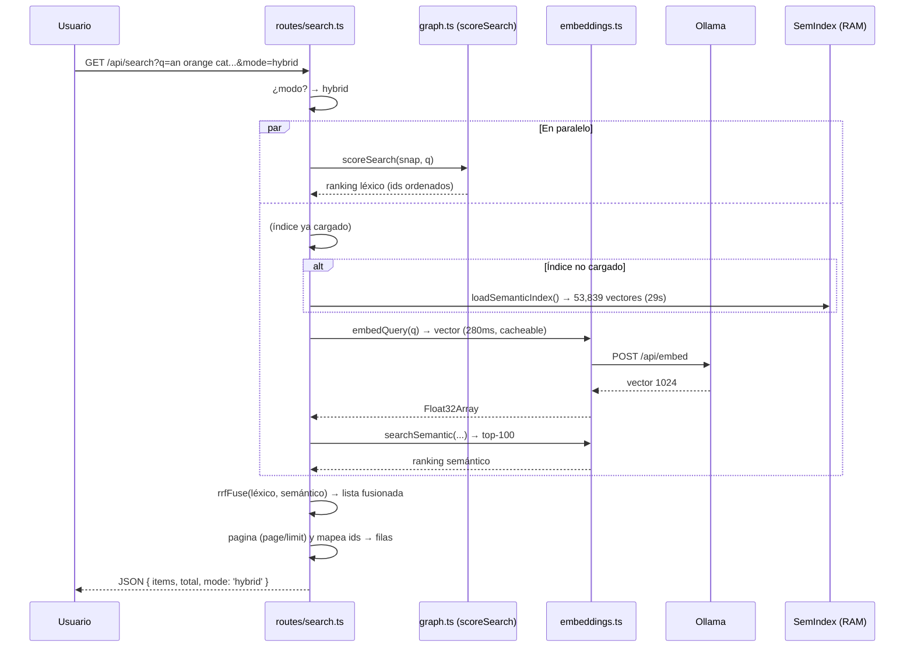
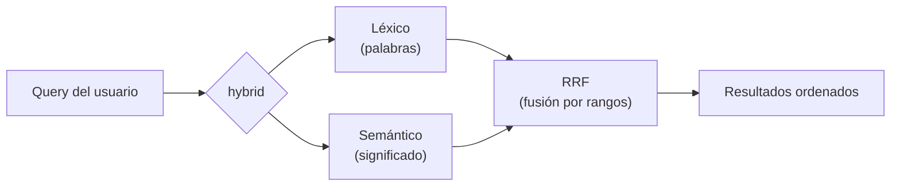

# VORAEL — Guía completa de búsqueda semántica (Embeddings)

> **Banco de imágenes generadas por IA**
> Corporación Universitaria Americana
> Módulo nuevo: búsqueda por **significado** (no solo por palabras)
> Fecha: 2026-09-10 · Estado: implementado y verificado contra la réplica (53,839 imágenes)

---

## ¿De qué trata esta guía?

VORAEL tenía un buscador **léxico** (por palabras exactas) que funcionaba bien hasta que el catálogo creció a **53,839 imágenes**. En ese punto aparecieron tres problemas:

| Problema | Ejemplo real | Efecto |
|---|---|---|
| 1. **Stopwords inflan la cobertura** | Búsqueda de "dibujo animado de un gato naranja tomando cafe en una cocina acogedora" | Devolvía 3,511 resultados (casi todo el catálogo), con fotorrealistas arriba — no dibujos animados |
| 2. **Queries cortas son OR puro** | "gato naranja" | El primer resultado era... un **gato negro** |
| 3. **Sin sinonimia** | "felino", "automóvil", "poniente" | No encuentra "gato", "coche", "atardecer" |

Esta guía explica **cómo se construyó la solución**: un motor de **embeddings semánticos** con tres modos de búsqueda, un script para generar los vectores, y cómo sobrevive a fallos sin romper nada.

---

## Los embeddings en palabras simples

### ¿Qué es un embedding?

Un embedding es **convertir una palabra o frase en una lista de números** que representan su *significado*. Cada palabra se convierte en un **punto en un espacio matemático de 1024 dimensiones**.

**Analogía:** Piensa en Google Maps.
- Las palabras son **lugares**.
- Los embeddings les dan **coordenadas** a esos lugares.
- Las palabras con **significados parecidos** quedan *cerca* en el mapa.
- Las palabras con **significados opuestos** quedan *lejos*.



**El punto clave:** el buscador antiguo preguntaba *"¿aparece la palabra exacta?"*. El nuevo preguntaba *"¿a qué se parece?"*. Por eso "felino" ahora encuentra "gato", y una búsqueda en **inglés** encuentra imágenes descritas en **español** (el modelo bge-m3 es multilingüe).

### El modelo: bge-m3

| Propiedad | Valor |
|---|---|
| Nombre | **bge-m3** (BAAI General Embedding, v3) |
| Dimensiones | **1024** números por vector |
| Idiomas | Multilingüe (inglés + español y ~100 más) |
| Tamaño en disco | ~1.2 GB |
| Dónde corre | **Ollama local** → `http://127.0.0.1:11434` |
| GPU usada | NVIDIA RTX 2050 (4 GB VRAM) |

**Analogía:** bge-m3 es el "traductor de significados". Es un modelo de IA que ya fue entrenado con miles de millones de textos en muchos idiomas y aprendió que "gato" y "cat" *significan lo mismo*, aunque se escriban distinto.

---

## Arquitectura completa

Un vistazo de todo el sistema de embeddings, de arriba a abajo:



### El modelo de datos

Los vectores **no** se guardan dentro de `generated_images`. Viven en una tabla aparte:

```sql
CREATE TABLE IF NOT EXISTS image_embeddings (
  id text PRIMARY KEY REFERENCES generated_images(id) ON DELETE CASCADE,
  embedding real[] NOT NULL,        -- los 1024 números del vector
  model text NOT NULL,              -- 'bge-m3' (por si cambia el modelo)
  updated_at timestamptz NOT NULL DEFAULT now()
);
```

**¿Por qué una tabla separada?** Porque `snapshot:prod` (el script que resincroniza la réplica desde producción) hace `TRUNCATE generated_images` en cada pasada. Si los vectores vivieran en esa tabla, se **borrarían** cada vez que se resincroniza. Al estar en la tabla aparte, sobreviven: solo hay que generar los vectores de las filas *nuevas*.

> La tabla está definida en **dos lugares** que deben mantenerse sincronizados:
> 1. `deploy/init.sql` (para bases de datos Docker recién creadas)
> 2. `ensureSchema()` en `apps/api/src/scripts/snapshot-prod.ts` (para réplicas existentes)

---

## El pipeline de generación (cómo se crearon los 53,839 vectores)

### El script `pnpm embeddings:build`



### ¿Qué texto se convierte en vector?

No se embeda la imagen (no es visión por computadora). Se embeda el **texto que la describe**, compuesto en un formato fijo y testeable — función `textToEmbed`:

```
[subject]
[style] · [mood] · [use_case]
tags: [tag1], [tag2], [tag3], ...
[enhanced_prompt — truncado a ~2000 caracteres]
```

**Ejemplo real:**
```
gato negro bajo la luna
Photorealistic · Calm · Wallpaper
tags: cat, night, moon, silhouette, dark
A black cat sitting under the moonlight, dramatic shadows,
silhouette against a full moon, photorealistic render...
```

El campo `enhanced_prompt` se trunca a 2,000 caracteres (`MAX_PROMPT_CHARS`) para que cada texto quepa holgado en la ventana de contexto del modelo sin crecer sin límite.

### El comportamiento "reanudable"

El script es **idempotente**: si se interrumpe a mitad (por ejemplo a los 20,000), al volver a ejecutarlo **salta** las imágenes que ya tienen embedding con el modelo actual:

```sql
SELECT g.id, g.subject, ...
FROM generated_images g
LEFT JOIN image_embeddings e ON e.id = g.id AND e.model = 'bge-m3'
WHERE e.id IS NULL
ORDER BY g.created_at ASC, g.id ASC
```

El `INSERT ... ON CONFLICT (id) DO UPDATE` hace que re-correr el script también funcione como un "recalcular todo".

### Las cifras reales de la generación

| Métrica | Valor |
|---|---|
| Imágenes procesadas | 53,839 |
| Velocidad medida | ~12-13 textos/s (textos reales de ~1,184 caracteres) |
| Tiempo total estimado | ~70 min |
| Tiempo total real | ~55 min |
| Dimensiones confirmadas | 1024 |
| Resultado | 53,839 / 53,839 · 100% |

---

## El motor semántico en la API (`embeddings.ts`)

Es un módulo nuevo y **puro** (sin efectos secundarios, todo testeable). Sus piezas:

### 1. El índice en memoria (`SemanticIndex`)

Cuando el API recibe su primera búsqueda `semantic` o `hybrid`, **carga** todos los vectores de la base a la RAM:

```
SELECT id, embedding, model FROM image_embeddings WHERE model = 'bge-m3'
→ Map<id, Float32Array>
```

- 53,839 vectores × 1024 números × 4 bytes (float32) = **~220 MB de RAM**.
- Tiempo de carga medido: **~29 segundos** para los 53,839.
- Se carga **una sola vez** y se queda en memoria (cache en `routes/search.ts`).



**Advertencia de precisión:** se usa `Float32Array` (ahorra la mitad de RAM frente a `number[]`). Este arreglo **no se debe mutar en sitio** — las funciones `cosine`, `searchSemantic` y `rrfFuse` son puras (crean resultados nuevos, no tocan el índice).

### 2. Similitud coseno (`cosine`)

La forma de medir **qué tan cerca** están dos vectores. Es una fórmula matemática clásica:

```
cosine(A, B) = (A · B) / (|A| × |B|)

A · B = suma de A[i] × B[i]   (producto punto)
|A|   = magnitud del vector A
```

**En palabras:** el ángulo entre las dos "flechas" de 1024 dimensiones. Si apuntan igual → **1** (idénticos). Si son perpendiculares → **0**. Si apuntan opuesto → **-1**.

| Caso | Resultado |
|---|---|
| "gato" vs "gato" | 1.00 |
| "gato" vs "felino" | ~0.94 (casi iguales) |
| "gato" vs "coche" | ~0.10 (muy distintos) |
| "gato" vs opuesto exacto | -1.00 |

### 3. Búsqueda semántica (`searchSemantic`)

1. Se convierte la **query del usuario** a vector (con `embedQuery`).
2. Se calcula el **coseno** contra los 53,839 vectores del índice.
3. Se quedan los que tienen score **> 0**.
4. Se ordenan de mayor a menor y se devuelven los **top 100**.



### 4. Cache de la query (`EmbeddingCache`)

Convertir la query a vector tarda ~**280 ms** (con la GPU ya caliente). Si muchos usuarios buscan lo mismo, sería un desperdicio repetirlo. Por eso existe una **cache LRU** (Least Recently Used) de 512 entradas:



- Si la misma query ya se buscó → se usa el vector cacheado (**~0 ms**).
- Si no → se pide a Ollama, se guarda en cache y se expulsa la entrada más vieja si se llena.

### 5. Fail-open (degradación elegante)

**El sistema nunca debe romperse porque Ollama esté caído.** Los tres fallos posibles y su manejo:

| Situación | Qué pasa |
|---|---|
| Ollama no responde | `embedQuery` devuelve `null` → se cae a **lexical** silenciosamente |
| La tabla `image_embeddings` no existe (réplica vieja) | `loadSemanticIndex` devuelve índice **vacío** → modos semantic/hybrid caen a lexical |
| Índice vacío o dims 0 | misma degradación |



**Analogía:** es como un coche híbrido. Si la batería eléctrica se agota, sigue andando con gasolina. Nada se ve en pantalla.

---

## Los tres modos de búsqueda

La búsqueda ahora tiene un interruptor: **`SEARCH_MODE`** (y por request, `?mode=`).

| Modo | Qué hace | Cuándo usarlo |
|---|---|---|
| `lexical` | token-match por palabras exactas (el buscador de siempre) | Cuando quieres resultados literales y rápidos |
| `semantic` | solo significado (coseno top-100) | Cuando el léxico no encuentra nada o la query es en otro idioma |
| `hybrid` | **fusiona ambos** con RRF | **Recomendado por defecto** — lo mejor de los dos |

### Cómo se decide el modo

```
?mode= si viene en la URL → se usa ese
si no → se usa SEARCH_MODE del .env
si no → lexical (default)
```

---

## El modo híbrido y la magia del RRF

Este es el corazón de la solución. **RRF = Reciprocal Rank Fusion** (fusión por rango recíproco).

### El problema que resuelve

El buscador léxico encuentra *palabras exactas*. El semántico encuentra *significados*. Cada uno tiene fortalezas:

- **Léxico** es preciso cuando la palabra existe literalmente (buscar "neon" debe dar cosas de neón).
- **Semántico** es flexible cuando cambia la palabra ("automóvil" → "Vehículo en vía urbana").

¿Cómo combinar dos rankings distintos, de dos "expertos" con escalas de puntuación incomparables? **No se suman los scores** (no son comparables). Se usan los **rangos** (posiciones).

### La fórmula

```
Para cada imagen que aparece en alguna de las dos listas:

  rrf_score = 1/(60 + posición_en_léxico) + 1/(60 + posición_en_semántico)

  (si no aparece en una lista, su término vale 0)
```



**La lógica:** si una imagen aparece **en ambas listas**, recibe dos fracciones y sube. Si solo aparece en una, recibe una sola fracción. Cuanto más arriba está en cada lista, más grande su fracción.

### Cálculo real (query "gato naranja")

```
Léxico:      1) gato negro jugando   2) gato negro bajo la luna  ...
Semántico:   1) gato atigrado        2) gato negro jugando      3) gato gris ...

Gato negro jugando:
  1/(60+1)  [líder léxico] + 1/(60+2) [2º semántico] = 0.0164 + 0.0161 = 0.0325  ← TOP

Gato atigrado:
  0 [no en léxico] + 1/(60+1) [líder semántico] = 0.0164

Gato negro bajo la luna:
  1/(60+2) [2º léxico] + 0 = 0.0161
```

**Resultado:** las imágenes que *ambos* motores consideran relevantes ganan. El ruido de uno solo se hunde.

---

## El flujo completo de una búsqueda (paso a paso)

Cuando un usuario escribe "an orange cat sitting by the window":



### Si algo falla en el camino

```
Si loadSemanticIndex falla   → rankedIds = ranking léxico (como ''lexical')
Si embedQuery devuelve null  → mismos
Si todo bien                 → RRF fusiona y páginas
```

El usuario **nunca ve un error 500** por culpa de Ollama.

---

## Configuración (variables de entorno)

| Variable | Qué controla | Default | Valores |
|---|---|---|---|
| `SEARCH_MODE` | Modo por defecto cuando no llega `?mode=` | `lexical` | `lexical` / `semantic` / `hybrid` |
| `EMBED_MODEL` | Modelo de embeddings | `bge-m3` | `bge-m3` (1024) / `nomic-embed-text` (768) |
| `EMBED_SERVER` | Dónde corre Ollama | `http://127.0.0.1:11434` | URL de Ollama |
| `EMBED_DIM` | Dimensiones del modelo | `1024` | coincide con el modelo |

Ejemplo en `apps/api/.env` para activar el modo híbrido por defecto:

```
SEARCH_MODE=hybrid
EMBED_MODEL=bge-m3
EMBED_SERVER=http://127.0.0.1:11434
EMBED_DIM=1024
```

### La API acepta override por request

Aunque el `.env` diga `lexical`, cualquier cliente puede pedir el modo que quiera:

```
GET /api/search?q=gato&mode=semantic     → solo significado
GET /api/search?q=gato&mode=hybrid       → fusión
GET /api/search?q=gato                   → lo que diga SEARCH_MODE
```

La respuesta siempre incluye el campo `mode` usado, para que el frontend pueda saber qué pasó:

```json
{
  "items": [...],
  "total": 620,
  "mode": "hybrid",
  "page": 1,
  "limit": 24,
  "hasMore": true
}
```

---

## Resultados de la verificación (casos reales)

Esto es lo que **realmente** pasó cuando se probó contra la réplica completa de 53,839 imágenes:

### Caso 1 — Sinónimos y otro idioma ✅
**Query:** `"an orange cat sitting by the window"` (inglés, y "naranja" no existe literalmente en el catálogo)

| Modo | Primeros resultados |
|---|---|
| `semantic` | gato observando exterior · gato siamés en ventana · gato atigrado mirando por la ventana |
| `hybrid` | mezcla de gente en ventanas (léxico) + gatos (semántico) |

**Antes:** no había forma de que "an orange cat" (inglés) encontrara gatos descritos en español.

### Caso 2 — Sinonimia de término ✅
**Query:** `"automóvil deportivo rojo"` (la palabra "automóvil" no existe en el catálogo)

| Modo | Primeros resultados |
|---|---|
| `lexical` | escuela conectada · contrato laboral (basura — "automóvil" no está) |
| `hybrid` | **conductor en cabina** · **Vehículo en vía urbana** (¡significado captado!) |

### Caso 3 — Stopwords (párrafos) ✅
**Query:** `"un gato naranja tomando cafe en la cocina acogedora"`

| Antes | Después (hybrid) |
|---|---|
| 3,511 resultados (todo el catálogo, fotorrealistas arriba) | **7 resultados**, con gatos y escenas de café |

### Caso 4 — Calidad del semantic puro ✅
**Query:** `"gato"`

| Modo | Primeros resultados |
|---|---|
| `semantic` | gato negro persiguiendo un bicho · gato blanco sorprendido · gato observando el exterior |
| `hybrid` | los mismos gatos + variantes |

---

## Requisitos para arrancar desde cero

### Si ya tienes la réplica local corriendo

```bash
# 1. Descargar el modelo (una sola vez)
ollama pull bge-m3

# 2. (Ya hecho en esta réplica) asegurar que la tabla exista
#    — se crea sola en snapshot:prod / init.sql

# 3. Generar los 54k vectores (una sola vez, ~55 min, reanudable)
cd apps/api
DB_HOST=localhost DB_PORT=5433 DB_NAME=generated_images \
DB_USER=vorael DB_PASSWORD=vorael123 EMBED_MODEL=bge-m3 \
pnpm embeddings:build

# 4. Activar hybrid (o semantic) y reiniciar la API
#    → SEARCH_MODE=hybrid en apps/api/.env
```

### Si empiezas de cero en otra máquina

```
1. PostgreSQL + réplica (correr snapshot:prod)   → genera la tabla image_embeddings
2. ollama pull bge-m3                             → modelo de embeddings
3. pnpm embeddings:build                          → llena la tabla (una vez)
4. SEARCH_MODE=hybrid en el .env                  → modo de búsqueda
```

### Lo que NO hay que hacer

- **No** correr `embeddings:build` contra producción sin confirmar cuánta RAM tiene el servidor (el índice son ~220 MB).
- **No** mutar el `Float32Array` del índice en sitio (rompe las funciones puras).
- **No** dejar de lado `image_embeddings` en los dos sitios (`init.sql` + `snapshot-prod.ts`): si solo se crea en uno, una réplica nueva quedará sin tabla.

---

## Preguntas frecuentes (FAQ)

### ¿Cuánto tarda una búsqueda semántica?

Depende de si la query se cachea:

| Paso | Tiempo |
|---|---|
| Convertir la query a vector (primera vez, GPU caliente) | ~280 ms |
| Cache LRU (queries repetidas) | ~0 ms |
| Coseno contra 53,839 vectores | decenas de ms |
| Fusionar + paginar | ~0 ms |

### ¿Qué pasa si cambio de modelo (bge-m3 → nomic-embed-text)?

El campo `model` de la tabla lo maneja solo: el script **re-embeda** toda imagen cuyo embedding sea de un modelo distinto. Pero ojo: la mezcla de vectores de dos modelos distintos **no es comparable** — hay que re-generar todo con el nuevo modelo.

### ¿Cuánta RAM consume?

~220 MB en el proceso API con bge-m3 y 53,839 imágenes (1024 dims × 54k × 4 bytes). Con `nomic-embed-text` (768 dims) serían ~165 MB; con `e5-small` (384 dims) ~83 MB.

### ¿Los embeddings de las imágenes nuevas se generan solos?

**No automáticamente.** Cuando n8n crea una imagen nueva, el API la muestra (léxico) al instante, pero su vector no existe hasta que se corra `pnpm embeddings:build` de nuevo (el script procesa solo las pendientes). Es un comando manual/periódico, no un watcher.

### ¿Y si Ollama y PostgreSQL están caídos a la vez?

Con `DB_MOCK=true` todo funciona sin Ollama, sin Docker y sin tabla: el modo semantic/hybrid degrada a lexical sobre los 30 mock images. Por eso los tests corren sin servicios externos.

### ¿Por qué top-100 y no los 53,839?

`searchSemantic` devuelve los **mejores 100** por coseno (un "límite de zona de confianza"). Para RRF es suficiente: las imágenes que están más allá del top-100 de cada lista nunca ganarán la fusión. El `total` real del modo semantic es 100 (el rango completo ya no se recorre).

### ¿Esto reemplaza al buscador léxico?

No — lo **complementa**. El léxico es el que sigue dando el `total` de resultados para el conteo de páginas en hybrid, y es el fallback universal. El híbrido es la suma de ambos.

---

## El estado del proyecto en cifras

| Métrica | Valor |
|---|---|
| Test suite | **133/133 pasan** (antes 131 + 2 fallos de metadatos, ahora también arreglados) |
| Typecheck API | limpio |
| Typecheck Web | limpio |
| Vectores generados | 53,839 (dims 1024) |
| Archivos nuevos | `embeddings.ts`, `embeddings-build.ts`, `test/embeddings.test.ts` (13 tests) |
| Archivos tocados | `config.ts`, `graph.ts` (scoreSearch), `routes/search.ts`, `snapshot-prod.ts`, `init.sql`, `.env.example`, `AGENTS.md`, tests |

---

## Resumen en una frase

**Le dimos a VORAEL un segundo "ojo" para buscar: el léxico mira las palabras exactas y el semántico capta el significado, y el modo híbrido los fusiona para que los resultados sean siempre lo mejor de ambos mundos.**



*Documento de referencia técnica — VORAEL, Corporación Universitaria Americana.*
*Implementado: 2026-09-10 · Verificado contra réplica de 53,839 imágenes.*