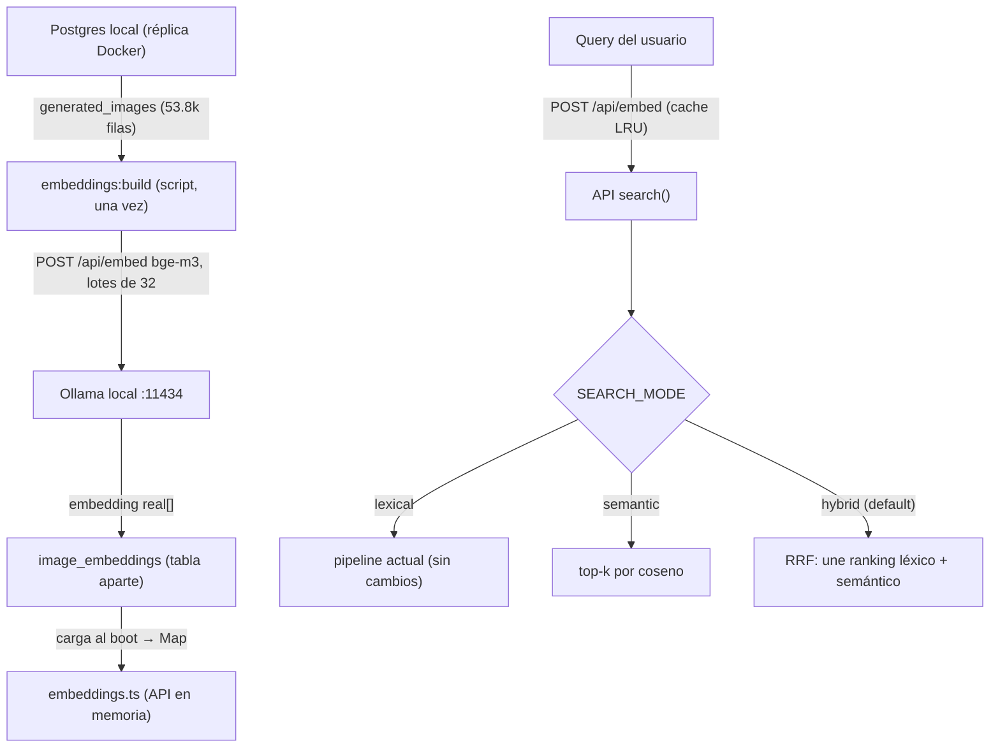

# Plan de Implementación — Búsqueda Semántica Híbrida (Embeddings)

> **Proyecto:** VORAEL — Banco de Imágenes Generadas por IA
> **Fecha:** 2026-09-10
> **Estado:** Aprobado por el usuario. Pendiente de ejecución.

## Contexto

El buscador actual (`search()` en `apps/api/src/graph.ts`) es **léxico**: compara tokens normalizados (plural mínimo, sin acentos) y pondera por campo (tags ×4, subject ×2, prompts ×1). En pruebas contra la réplica real (53,839 imágenes) mostró 3 problemas:

1. **Stopwords inflan la cobertura** — `de, un, en, una` aparecen en casi todas las imágenes; en queries largas regalan matches y sacan resultados genéricos arriba.
   - Ej: `"dibujo animado de un gato naranja tomando cafe en una cocina acogedora"` → 3,511 res, top fotorrealistas — no dibujo animado.
2. **Queries de 2-3 términos son OR puro** — con 2 términos basta coincidir en 1.
   - Ej: `gato naranja` → top es "gato negro".
3. **Sin sinonimia** — "felino" no encuentra "gato", "poniente" no encuentra "atardecer".

## Decisiones (acordadas con el usuario)

| # | Decisión | Razón |
|---|---|---|
| 1 | Tabla separada `image_embeddings` con `embedding real[]` | El `TRUNCATE` de `snapshot:prod` no debe borrar vectores en cada resync |
| 2 | Nada de pgvector — búsqueda en memoria en la API | No toca la imagen Docker ni el volumen `pgdata` |
| 3 | Modelo `bge-m3` (1024 dims, multilingüe EN/ES) | Mejor calidad; fallback `nomic-embed-text` (768) si OOM/lento |
| 4 | `SEARCH_MODE=hybrid` (default) con **RRF** | Combina semántica + léxico; robusto frente a los 3 problemas |
| 5 | Degradación fail-open | Si Ollama/embeds fallan → cae a `lexical`; `DB_MOCK` y tests intactos |
| 6 | Entorno: Ollama local `:11434`, GPU RTX 2050 (~1.6GB VRAM libres), internet OK | Infra ya disponible; solo falta `ollama pull bge-m3` |

## Arquitectura



### Modelo de datos

Tabla nueva (existente en los DOS lugares, se mantienen sincronizados):
- `deploy/init.sql` — para Docker recién creado.
- `ensureSchema()` en `apps/api/src/scripts/snapshot-prod.ts` — para réplicas existentes.

```sql
CREATE TABLE IF NOT EXISTS image_embeddings (
  id text PRIMARY KEY REFERENCES generated_images(id) ON DELETE CASCADE,
  embedding real[] NOT NULL,
  model text NOT NULL,
  updated_at timestamptz NOT NULL DEFAULT now()
);
```

La tabla es **separada** a propósito: `snapshot:prod` solo hace `TRUNCATE generated_images`, así los vectores sobreviven a los resyncs. Solo se re-embedarán filas nuevas o con `model ≠`.

## Fases de ejecución

### Fase 1 — Modelo y benchmark
1. `ollama pull bge-m3`.
2. Benchmark en `/tmp`: confirmar dims (1024), latencia y throughput con lote de 32.
3. Si OOM o < 5 textos/s con batch → `ollama pull nomic-embed-text` (768 dims).
4. Fijar `EMBED_MODEL` y `EMBED_DIM` en config.

### Fase 2 — Tabla `image_embeddings`
- `CREATE TABLE IF NOT EXISTS` en `deploy/init.sql` y en `ensureSchema()` del snapshot.

### Fase 3 — Script `pnpm embeddings:build`
Nuevo `apps/api/src/scripts/embeddings-build.ts`:
1. SELECT `id, subject, tags, style, mood, use_case, enhanced_prompt` desde `generated_images`.
2. **Composición del texto a embedar** (función pura, testeable), `enhanced_prompt` truncado a ~2000 chars:
   ```
   subject
   style · mood · use_case
   tags: [lista separada por comas]
   enhanced_prompt
   ```
3. Skip de ids ya embedidos con el modelo actual (`LEFT JOIN image_embeddings WHERE model = $EMBED_MODEL`).
4. Lotes de 32 → `POST /api/embed { model, input: [...] }` → `INSERT ... ON CONFLICT (id) DO UPDATE`.
5. Reanudable, progreso cada 500, verificación final de conteo.

Uso:
```
DB_HOST=localhost DB_PORT=5433 DB_NAME=generated_images DB_USER=vorael DB_PASSWORD=vorael123 \
  EMBED_MODEL=bge-m3 pnpm embeddings:build
```

### Fase 4 — Motor semántico en la API (`embeddings.ts`)
- `loadEmbeddings(db)`: `Map<string, Float32Array>` desde `image_embeddings`; si `< 10` filas → semántica desactivada (cae a `lexical`).
- `embedQuery(text)`: `POST /api/embed` con la query, **cache LRU ~500**, timeout y fail-open.
- `cosine(a, b)` sobre Float32Array.
- `searchSemantic(snap, vector, k)`: top-k por coseno (fast path).

### Fase 5 — Integración en `search()` (hybrid RRF)
- `config.ts`: `SEARCH_MODE=hybrid|semantic|lexical`, `EMBED_MODEL=bge-m3`, `EMBED_SERVER=http://127.0.0.1:11434`, `EMBED_DIM=1024`.
- `search()` recibe modo + embeddings:
  - `lexical` → pipeline actual.
  - `semantic` → coseno, paginado, fecha como desempate.
  - `hybrid` → RRF: `rrf(rank) = Σ 1 / (60 + rank)`, candidatos = unión top-K léxico + top-K semántico.
  - Sin embeddings → `hybrid` y `semantic` degradan a `lexical`.
- `routes/search.ts`: acepta `?mode=`, lo exponer en la respuesta.

### Fase 6 — Tests (sin servicios externos)
Nuevo `apps/api/test/embeddings.test.ts`:
- `cosine`: igual → 1; ortogonal → 0; negativo → correcto.
- `searchSemantic`: matriz falsa pequeña → top-k esperado.
- RRF: fusionar dos rankings conocidos → orden verificado a mano.
- `textToEmbed`: truncado, campos concatenados, tags.
- Degradación: `search()` sin embeddings → igual que `lexical` (mocks intactos).

### Fase 7 — Verificación contra la réplica
Repetir con `SEARCH_MODE=hybrid`:
1. `"dibujo animado de un gato naranja tomando cafe en una cocina acogedora"` → dibujo animado / gatos arriba.
2. `"felino gordo durmiendo"` → encuentra gatos (sinonimia).
3. `"gato naranja"` → gatos naranjas reales.
4. Sanidad: `"neon"`, `"ilustracion digital"` no degradan.
5. Registrar latencia endpoint y memoria del proceso antes/después.

## Archivos afectados

| Archivo | Cambio |
|---|---|
| `apps/api/package.json` | script `embeddings:build` |
| `apps/api/src/scripts/embeddings-build.ts` | NUEVO — generador de embeddings |
| `apps/api/src/embeddings.ts` | NUEVO — carga + coseno + searchSemantic + cache LRU |
| `apps/api/src/config.ts` | envs `SEARCH_MODE`, `EMBED_*` |
| `apps/api/src/graph.ts` | `search()` modos semantic/hybrid (RRF), `textToEmbed` |
| `apps/api/src/routes/search.ts` | aceptar `mode`, exponer en respuesta |
| `apps/api/src/scripts/snapshot-prod.ts` | `ensureSchema()` + tabla `image_embeddings` |
| `deploy/init.sql` | idem |
| `apps/api/.env.example` | documentar nueva configuración |
| `apps/api/test/embeddings.test.ts` | NUEVO — tests |
| `AGENTS.md` | docs (comandos, arquitectura semántica) |
| `docs/` | actualizar guía/cheatsheet |

## Orden de ejecución

1 → 2 → 3 → 4 → 5 → 6 → 7

## Riesgos y notas

- **RAM**: +~220MB al proceso API (bge-m3 1024 dims × 54k × 4B). Alternativas: nomic (768 → ~165MB), e5-small (384 → ~83MB).
- **Tiempo de generación**: 54k textos en RTX 2050 — variable (minutos a >1h); script reanudable e idempotente.
- **Latencia por query**: embed (~50-150ms) + búsqueda en memoria (~20-50ms); cache LRU suaviza queries repetidas.
- **Fallback seguro**: cualquier fallo de Ollama/embeds degrada a léxico; `DB_MOCK` y tests siguen sin embeds.
- **Prod real**: se valida contra la réplica local primero; migrar a producción (vía túnel) es un paso posterior que replica tabla + build por SSH.