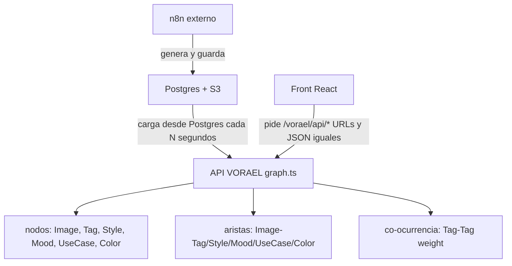

# Plan de Implementación — Motor de Búsqueda por Grafos

> **Proyecto:** VORAEL — Banco de Imágenes Generadas por IA
> **Fecha:** 2026-08-30

## Decisiones

| # | Decisión | Razón |
|---|---|---|
| 1 | Token-match (frontera de palabra + plural mínimo) | Precisión: "gato" pega con "gatos" pero no con "categoría" |
| 2 | Graphology (in-memory, `graph.ts`) | Motor de grafo sin dependencias externas de BD |
| 3 | Reload periódico + atomic swap | Freshness acotada (60s), cero estados a medias |
| 4 | `GET /api/images` queda en SQL | Home siempre en vivo, query trivial |
| 5 | Incrustación EXIF/IPTC vía exiftool | Bonus de portabilidad; reingesta: fuera de alcance |
| 6 | Migrar: search, related, tags, filters, stats | Todas las rutas con GROUP BY/agregación |
| 7 | Tests: Vitest + carpeta `test/` | Framework compatible con ecosistema Vite |

## Arquitectura del Grafo

### Nodos
- `(:Image)` — id, s3_key, s3_url, prompts, tags, style, mood, color_palette, use_case, filename, created_at
- `(:Tag)` — name
- `(:Style)` — name
- `(:Mood)` — name
- `(:UseCase)` — name
- `(:Color)` — hex

### Aristas
- `(:Image)-[:TAGGED_WITH]->(:Tag)`
- `(:Image)-[:HAS_STYLE]->(:Style)`
- `(:Image)-[:HAS_MOOD]->(:Mood)`
- `(:Image)-[:FOR_USE_CASE]->(:UseCase)`
- `(:Image)-[:HAS_COLOR]->(:Color)`
- `(:Tag)-[:CO_OCCURS_WITH {weight}]->(:Tag)`

### Índices de Apoyo (fuera de Graphology)
- `Map<id, ImageRow>` — acceso rápido a fila completa
- `Map<dimension, Set<id>>` — invertido por tag/style/mood/use_case/color
- Texto tokenizado por imagen (minúsculas, frontera de palabra + plural)
- Lista global ordenada `(created_at DESC, id DESC)` — paginado determinista

## Cronograma

### Fase 0 — Limpieza + Docs
- [x] Borrar `PLAN_BUSQUEDA_GRAFOS.md`
- [x] Crear `docs/`
- [x] Crear `docs/PLAN_GRAFOS.md`
- [x] Quitar `useDebounce` muerto de `lib/utils.ts`
- [x] Actualizar `README.md` (sección "Motor de búsqueda")
- [x] Actualizar `ARQUITECTURA.md` (sección 3: contrato completo del API + motor de grafos)
- [x] Actualizar `DEPLOY.md` (exiftool)

### Fase 1 — Motor + Tests
- [x] Instalar `graphology` + `@types/graphology` + vitest + supertest
- [x] Crear `apps/api/src/graph.ts`
- [x] Crear `apps/api/vitest.config.ts`
- [x] Crear `apps/api/test/fixtures/images.ts`
- [x] Crear `apps/api/test/graph.test.ts`
- [x] Crear `apps/api/test/search.test.ts`
- [x] Crear `apps/api/test/related.test.ts`
- [x] Crear `apps/api/test/tags.test.ts`
- [x] Crear `apps/api/test/facets.test.ts`

### Fase 2 — Migrar Rutas
- [x] Migrar `search.ts` → graph store
- [x] Migrar `images.ts /related` → graph store
- [x] Migrar `tags.ts` → graph store
- [x] Migrar `filters.ts` → graph store
- [x] Migrar `stats.ts` → graph store
- [x] Actualizar `index.ts` (ciclo de vida del store, `require.main` guard)
- [x] Crear `apps/api/test/routes.test.ts`

### Fase 3 — EXIF/IPTC
- [x] Config `METADATA_EMBED` en `config.ts`
- [x] Wrapper exiftool en `metadata.ts`
- [x] Crear `apps/api/test/exif.test.ts`
- [x] Actualizar `DEPLOY.md`

### Fase 4 — Benchmark + Cierre
- [x] Script `apps/api/bench/compare.ts`
- [x] typecheck + build + test final (98/98 pasando)
- [x] Actualizar checklist en `docs/PLAN_GRAFOS.md`
