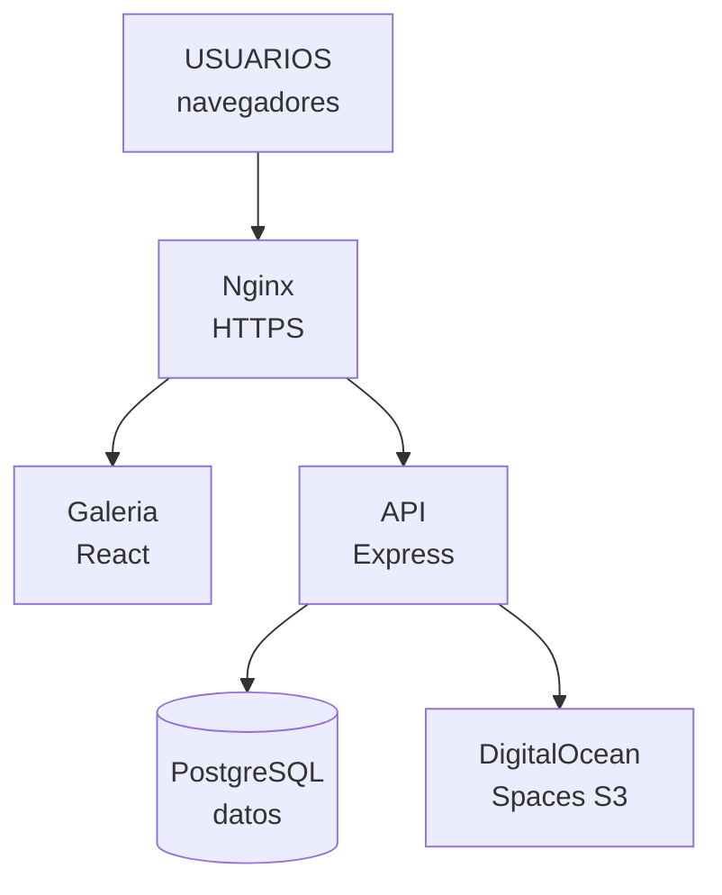
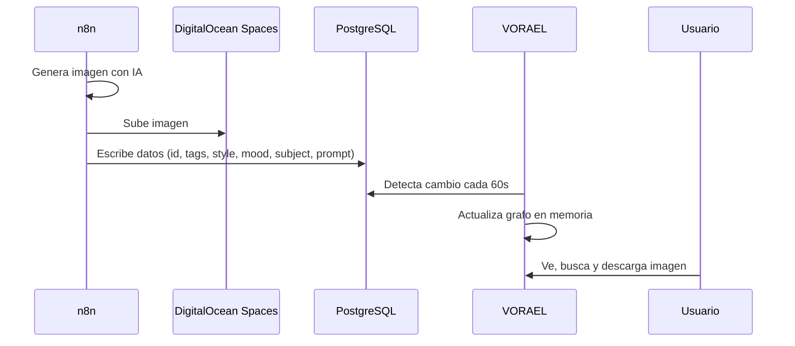
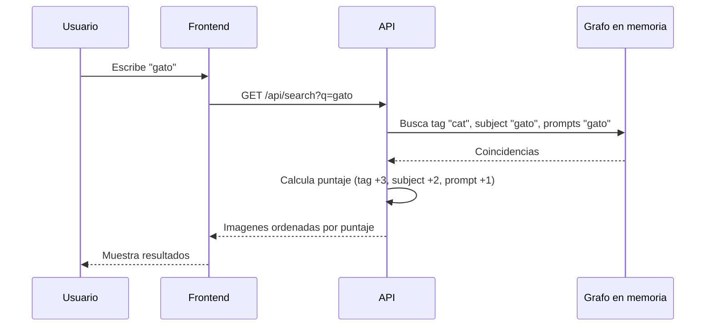
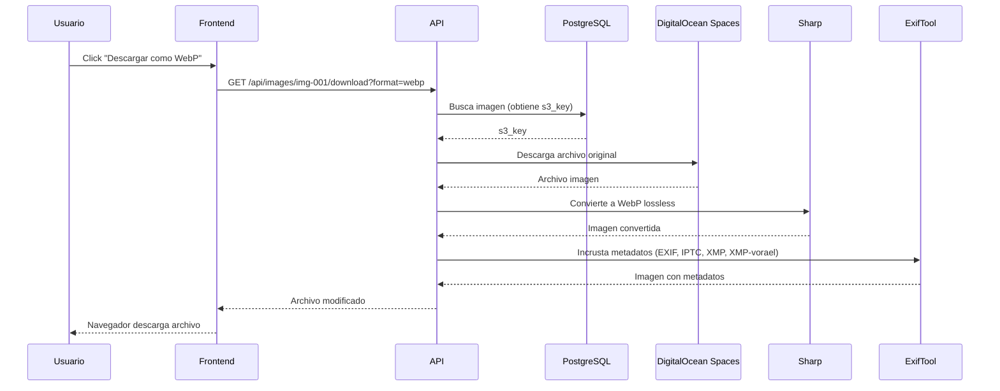
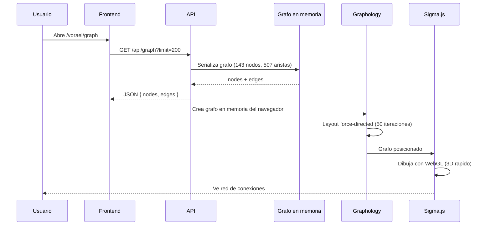
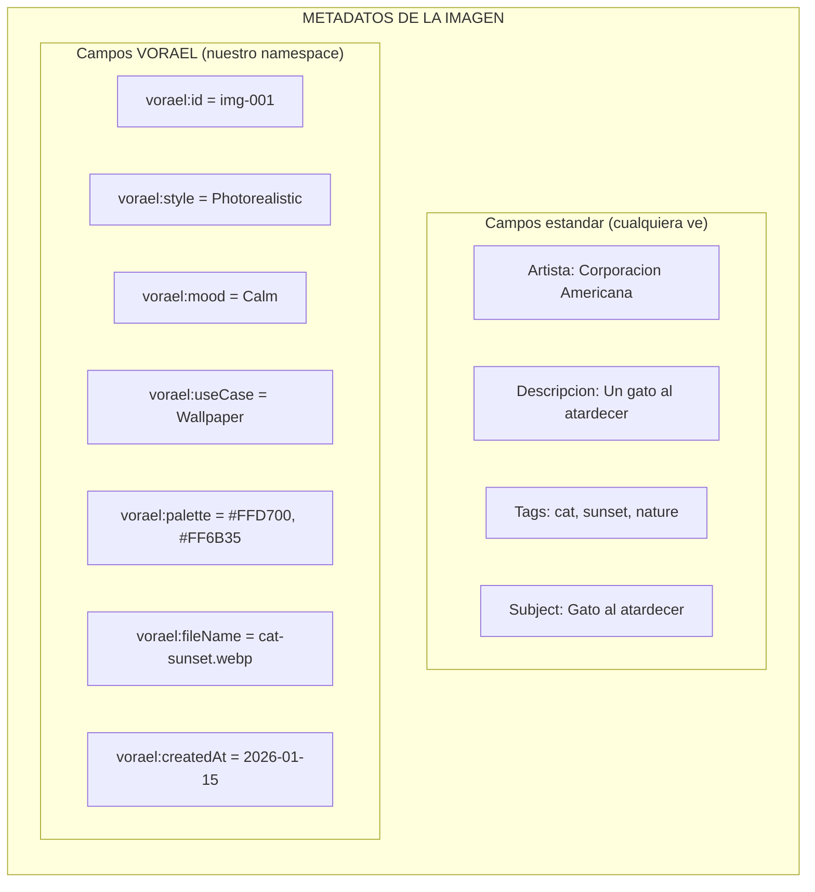
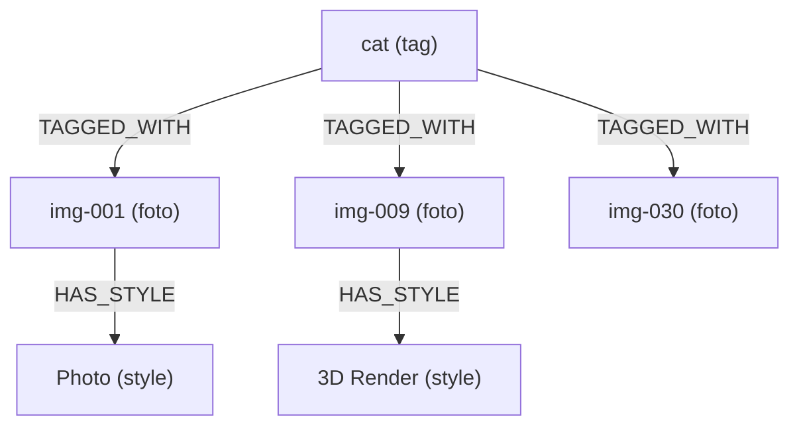
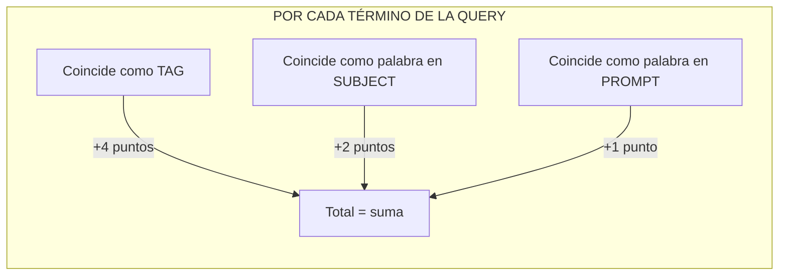
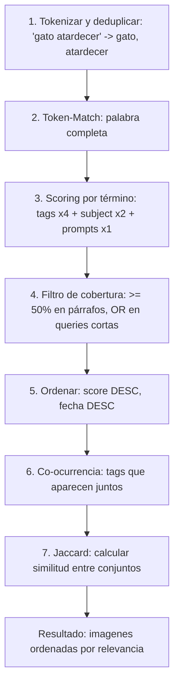

# VORAEL — Guía completa para la reunión

> **Banco de imágenes generadas por IA**
> Corporación Universitaria Americana
> https://n8n.americana.edu.co/vorael/

---

## ¿Qué es VORAEL?

VORAEL es un **catálogo de imágenes generadas por inteligencia artificial** para la Corporación Universitaria Americana. Piensen en él como un **Pinterest interno**: las imágenes las genera un proceso automático (n8n), las guarda en la nube, y VORAEL las muestra en una galería bonita donde se pueden buscar, filtrar y descargar.

**Lo que VORAEL NO hace:**
- No genera imágenes (eso lo hace n8n)
- No sube imágenes (eso también lo hace n8n)
- No edita imágenes

**Lo que VORAEL SÍ hace:**
- Muestra las imágenes en una galería con filtros
- Permite buscar por palabras clave
- Muestra relaciones entre imágenes (qué tags tienen en común)
- Descarga las imágenes en diferentes formatos
- Incrusta metadatos en cada imagen descargada
- Muestra un grafo visual de conexiones (como un mapa de relaciones)

---

## El equipo técnico (stack tecnológico)

Piensen en el sistema como una casa con varias habitaciones:

### La casa completa



### Cada pieza explicada

| Pieza | Qué es en palabras simples | Ejemplo cotidiano |
|---|---|---|
| **Nginx** | El portero de la edificio. Recibe todas las peticiones de internet y las redirige al lugar correcto. | Como la recepcionista que dice "su cita es en el piso 3" |
| **React (SPA)** | La interfaz visual que ve el usuario. Es una "Single Page Application": todo se carga una vez y luego solo cambia el contenido. | Como Gmail: cargas la página y todo se mueve sin recargar |
| **Express (API)** | El cerebro del sistema. Recibe peticiones, consulta datos, y devuelve respuestas en JSON. | Como un mesero: toma tu pedido, va a la cocina, y te trae la comida |
| **PostgreSQL** | La base de datos. Guarda toda la información de las imágenes en tablas organizadas. | Como una hoja de Excel gigante con columnas: nombre, tags, estilo, etc. |
| **DigitalOcean Spaces** | Almacenamiento en la nube (como Google Drive pero para programadores). Aquí viven los archivos de imagen. | Como un Dropbox pero para el sistema |
| **Sharp** | Una librería que convierte imágenes. Convierte PNG → WebP, redimensiona, optimiza. | Como Photoshop pero automático y rápido |
| **ExifTool** | Un programa que lee y escribe metadatos en imágenes. Los metadatos son "notas pegadas" al archivo. | Como escribir en la espalda de una foto: "tomada en Paris, 2024" |
| **Graphology** | Una librería para manejar grafos (nodos conectados con líneas). Usa para buscar relaciones. | Como un mapa del metro: estaciones (nodos) conectadas por líneas (aristas) |
| **Sigma.js** | Una librería para dibujar grafos en pantalla con gráficos 3D rápidos (WebGL). | Como Google Maps pero para mostrar relaciones entre cosas |
| **TanStack Query** | Maneja cómo el frontend pide datos al backend y los.cachea. | Como un bibliotecario que recuerda los últimos libros que pediste |

---

## Flujo de datos: ¿Cómo funciona todo?

### Flujo 1: Llega una imagen nueva



### Flujo 2: El usuario busca "gato"



### Flujo 3: El usuario descarga una imagen



### Flujo 4: El grafo visual (la red de conexiones)



---

## El sistema de metadatos incrustados

### ¿Qué son los metadatos?

Los metadatos son **información oculta que viaja dentro del archivo de imagen**. No se ve en la foto, pero cualquier programa puede leerla.

**Analogía:** Es como escribir en la espalda de una fotografía impresa:
- "Tomada en Paris, 2024"
- "Fotógrafo: Juan Pérez"
- "Evento: Boda de María"

En las imágenes digitales, esto se guarda en cabeceras especiales (EXIF, IPTC, XMP).

### ¿Por qué incrustar metadatos?

Cuando un usuario descarga una imagen de VORAEL, esa imagen lleva todos sus datos consigo. Si la comparte por WhatsApp, la sube a Instagram, o la guarda en su computadora, **la información no se pierde**.

### Los tres tipos de metadatos que usamos

| Tipo | Qué guarda | Ejemplo | ¿Quién lo lee? |
|---|---|---|---|
| **EXIF** | Datos técnicos y descripción | Artista, descripción, fecha | Cualquier programa de fotos |
| **IPTC** | Palabras clave y categoría | Tags: "cat, sunset, nature" | Adobe Bridge, Lightroom |
| **XMP** | Datos estructurados | Subject, título | Photoshop, ExifTool |

### Nuestro namespace personalizado: XMP-vorael

Además de los campos estándar, creamos un "espacio de nombres" propio llamado `XMP-vorael`. Es como crear una sección personalizada en la etiqueta de la imagen:



### ¿Qué pasa si ExifTool no está instalado?

**No pasa nada.** El sistema detecta si ExifTool existe al arrancar. Si no está:
- Las imágenes se sirven sin metadatos (pero se ven igual)
- Ningún error aparece en pantalla
- El usuario no se entera

Es como un coche híbrido: si se acaba la batería eléctrica, funciona con gasolina.

---

## El motor de búsqueda por grafos

### ¿Qué es un grafo?

Un grafo es una estructura de datos que muestra **relaciones entre cosas**.

**Ejemplo cotidiano:** Facebook
- Tú eres un **nodo** (punto)
- Tu amigo Pedro es otro **nodo**
- La línea que los conecta es una **arista** (relación: "amigos")

En VORAEL:
- Cada imagen es un nodo
- Cada tag es un nodo
- Cada estilo es un nodo
- Las líneas muestran qué tags tiene cada imagen

### Visualmente



### ¿Cómo se construye?

Cuando arranca el API, lee todas las imágenes de PostgreSQL y crea:

1. **Un nodo por cada imagen** (ej: `img-001`)
2. **Un nodo por cada tag** (ej: `tag:cat`)
3. **Un nodo por cada estilo** (ej: `style:Photorealistic`)
4. **Un nodo por cada mood** (ej: `mood:Calm`)
5. **Un nodo por cada color** (ej: `color:#FFD700`)
6. **Líneas conectando** cada imagen con sus tags, estilos, moods y colores
7. **Líneas entre tags** que aparecen juntos (co-ocurrencia)

### ¿Cómo se busca?

Cuando buscas "cat sunset", el sistema:

1. **Tokeniza y deduplica**: `["cat", "sunset"]` (términos únicos, en minúsculas)
2. Para cada imagen calcula un **score por término** que coincide:
   - ¿Aparece como **tag**? → +4 puntos (peso alto)
   - ¿Aparece como palabra en el **subject**? → +2 puntos
   - ¿Aparece como palabra en el **prompt original o mejorado**? → +1 punto cada uno
3. **Filtro de cobertura** (para párrafos):
   - Queries de 1-3 términos: basta que **uno** coincida (comporta OR)
   - Queries largas: se exige que coincida **≥ 50%** de los términos únicos
4. **Ordena** por puntaje DESC (empate: fecha DESC, id DESC)
5. Devuelve las más relevantes

### ¿Qué es "related" (imágenes relacionadas)?

Cuando ves una imagen y haces click en "Ver relacionadas", el sistema:

1. Busca los vecinos directos de esa imagen en el grafo
2. Para cada otra imagen, cuenta cuántos vecinos comparten
3. Cuantos más vecinos compartan, más similares son
4. Si dos tags aparecen juntos muchas veces, suma puntos extra
5. Devuelve las top 8 más parecidas

---

## La vista de grafo interactivo

### ¿Qué muestra?

Una **red visual** donde puedes ver:
- Cada imagen como un punto morado
- Cada tag como un punto ámbar
- Cada estilo como un punto verde
- Cada mood como un punto púrpura
- Cada caso de uso como un punto cian
- Cada color como un punto gris

Las líneas muestran las conexiones.

### ¿Cómo funciona?

1. **Sigma.js** dibuja todo usando **WebGL** (la misma tecnología de los videojuegos 3D)
2. Los nodos se posicionan automáticamente con un **algoritmo force-directed**:
   - Los nodos se repelen (como imanes del mismo polo)
   - Los nodos conectados se atraen (como resortes)
   - Todo se centra en el medio
3. Puedes **hacer click** en cualquier nodo:
   - Si es una imagen → te lleva al detalle
   - Si es un tag → te lleva a la galería de ese tag
   - Si es un estilo/mood → resalta sus conexiones
4. Puedes **filtrar** por tipo con los botones de arriba

### Ejemplo de interacción

```
1. Abres /vorael/graph
2. Ves 143 nodos y 507 aristas
3. Haces click en "tag:cat"
4. Se resaltan todas las imágenes que tienen "cat"
5. Ves que img-001, img-009, img-030 están conectadas
6. Haces click en img-001
7. Te lleva al detalle de esa imagen
```

---

## El algoritmo de búsqueda (explicado paso a paso)

### ¿Cómo busca VORAEL?

Cuando escribes "gato atardecer" en el buscador, VORAEL no hace una búsqueda tonta como `ILIKE '%gato%'` (que pegaba en "categoría"). Usa un algoritmo más inteligente que combina varias técnicas.

### Paso 1: Tokenizar (separar en palabras)

El sistema separa tu búsqueda en palabras individuales:

```
"gato atardecer" → ["gato", "atardecer"]
```

Es como si un bibliotecario leyera tu pedido y dijera: "OK, necesito libros que tengan 'gato' Y también tengan 'atardecer'".

### Paso 2: Buscar palabra completa (Token-Match)

Cada palabra debe aparecer como **palabra completa**, no como parte de otra palabra:

```
[SÍ] "gato" matchea: "gato", "gatos" (plural mínimo)
[NO] "gato" NO matchea: "categoría", "agusete", "dátiles"

[SÍ] "atardecer" matchea: "atardecer", "atardeceres"
[NO] "atardecer" NO matchea: "despertar", "madrugada"
```

**Analogía:** Es como buscar en Google. Si buscas "gato", Google no te muestra resultados de "categoría" ni "agusete". Busca la palabra exacta.

### Paso 3: Calcular el puntaje (Scoring)

No todas las coincidencias valen lo mismo. El puntaje se calcula **por término**: cada palabra de tu búsqueda que coincide suma puntos según dónde aparezca.



**Ejemplo real** (query "cat sunset"):

```
Query: "cat sunset"

Imagen 1: tags=[cat, sunset, nature], subject="Cat at sunset"
  → "cat" coincide en tag: +4
  → "sunset" coincide en tag: +4
  → "cat" en subject: +2
  → "sunset" en subject: +2
  → TOTAL: 12 puntos [TOP]

Imagen 2: tags=[cat, library], subject="Cat in library"
  → "cat" coincide en tag: +4
  → "sunset" NO coincide: +0
  → TOTAL: 4 puntos

Imagen 3: tags=[dog, park], subject="Dog in park"
  → "cat" NO coincide: +0
  → "sunset" NO coincide: +0
  → TOTAL: 0 puntos
```

### Paso 4: Filtro de cobertura (para párrafos)

Aquí está la clave de la búsqueda "tipo párrafo". VORAEL cuenta **cuántos términos únicos** de tu consulta coincidieron en cada imagen:

```
"cat sunset"        → 2 términos únicos
"a cat sleeping on  → 9 términos únicos
 old books in a
 grand library"
```

- **Queries cortas (1-3 términos):** basta que **un** término coincida. Esto mantiene el comportamiento OR de siempre: buscar "cat spaceship" devuelve las imágenes con tag "cat" aunque "spaceship" no exista.
- **Párrafos (4+ términos):** se exige que coincidan **al menos el 50%** de los términos únicos. Si escribes un párrafo de 14 palabras, solo aparecen imágenes que coincidan con 7 o más.

```
Párrafo: "a cat sleeping on old books in a grand library with golden light"

Imagen A: coincide con "a", "cat", "sleeping", "on", "old", "books",
          "in", "grand", "library" → 9/9 términos → 100% → APARECE
Imagen B: solo comparte "a" → 1/9 → 11% → NO aparece
```

Este filtro elimina el "ruido": antes un párrafo devolvía 157 imágenes (cualquiera que compartiera una palabra); ahora solo vuelven las realmente relevantes.

### Paso 5: Ordenar y devolver

Las imágenes se ordenan por puntaje (mayor a menor) y se devuelven las mejores.

```
1. Imagen 1 (12 pts) → ¡la más relevante!
2. Imagen 2 (4 pts)
3. Imagen 3 (0 pts) → no aparece en resultados
```

---

## Co-ocurrencia (cómo se encuentran imágenes similares)

### ¿Qué es co-ocurrencia?

Cuando dos tags aparecen **juntos** en muchas imágenes, tienen una relación fuerte. Esto se llama **análisis de co-ocurrencia**.

**Ejemplo cotidiano:** Netflix
- Si mucha gente que ve "Breaking Bad" también ve "Better Call Saul"
- Netflix aprende que esos dos shows están relacionados
- Cuando buscas uno, te muestra el otro

En VORAEL:
- Si "cat" y "sunset" aparecen juntos en 5 imágenes
- El sistema sabe que esas dos cosas están relacionadas
- Cuando ves una imagen con "cat", te muestra otras con "sunset"

### ¿Cómo se calcula?

```
IMG-001: tags = [cat, sunset, nature]
IMG-009: tags = [cat, cyberpunk, neon]
IMG-030: tags = [cat, library, books]
IMG-045: tags = [sunset, beach, ocean]

Co-ocurrencia:
  cat ↔ sunset: aparecen juntos en 1 imagen (IMG-001)
  cat ↔ cyberpunk: aparecen juntos en 1 imagen (IMG-009)
  cat ↔ library: aparecen juntos en 1 imagen (IMG-030)
  sunset ↔ beach: aparecen juntos en 1 imagen (IMG-045)
```

### ¿Cómo se usa para "imágenes relacionadas"?

Cuando haces click en "Ver relacionadas" de IMG-001:

1. **Busca vecinos directos** en el grafo (tags, style, mood, etc.)
2. **Cuenta cuántos vecinos comparten** con otras imágenes
3. **Calcula Jaccard similarity** (una fórmula matemática)
4. **Suma bonus** por co-ocurrencia fuerte

```
IMG-001 tiene vecinos: {cat, sunset, nature, Photorealistic, Calm}

IMG-009 tiene vecinos: {cat, cyberpunk, neon, 3D Render, Vibrant}
  → Vecinos compartidos: {cat}
  → Jaccard = 1/9 = 0.11

IMG-045 tiene vecinos: {sunset, beach, ocean, Photorealistic, Calm}
  → Vecinos compartidos: {sunset, Photorealistic, Calm}
  → Jaccard = 3/7 = 0.43  ← ¡Más parecida!
```

**Resultado:** IMG-045 aparece como "más relacionada" que IMG-009.

---

## Comparación con algoritmos estándar

### ¿Cómo se compara con Google/Elasticsearch?

| Concepto | VORAEL (nuestro) | Google/Elasticsearch |
|---|---|---|
| **Nombre del algoritmo** | Token-Match + Co-ocurrencia | BM25 + Inverted Index |
| **Búsqueda de texto** | Palabra completa, scoring fijo | TF-IDF, scoring dinámico |
| **Imágenes relacionadas** | Jaccard + co-ocurrencia | Collaborative filtering + embeddings |
| **Velocidad** | ~1ms (en memoria) | ~10ms (inverted index) |
| **Complejidad de implementación** | Baja (200 líneas) | Alta (miles de líneas) |
| **Para cuántos documentos** | 30 - 10,000 | 1,000 - 1,000,000,000 |

### ¿Por qué no usamos BM25 completo?

**BM25** (Best Matching 25) es el algoritmo que usa Google y Elasticsearch. Es más preciso pero más complejo:

```
BM25 pondera:
  - Frecuencia del término en el documento (TF)
  - Rareza del término en toda la colección (IDF)
  - Longitud del documento
  - Parámetros ajustables (k1, b)

Nuestro sistema pondera:
  - Tags: +3 puntos
  - Subject: +2 puntos
  - Prompts: +1 punto
```

**¿Por qué no lo usamos?** Para 30-1000 imágenes, la diferencia es mínima. BM25 brilla con millones de documentos.

### ¿Y los embeddings semánticos?

Los embeddings son la evolución natural de este sistema:

```
Token-Match (actual):
  "gato" = "gato" [SÍ]
  "felino" = "gato" [NO] (no sabe que son lo mismo)

Embeddings semánticos:
  "gato" = [0.23, -0.45, ...]
  "felino" = [0.21, -0.42, ...]  (muy parecido!)
  Similitud: 0.94 → ¡son lo mismo!
```

**Para cuándo:** Cuando tengas > 1000 imágenes y quieras buscar por significado, no solo por palabras.

---

## Resumen del algoritmo



**En una frase:** VORAEL busca palabra por palabra (con plural mínimo y acentos normalizados), pondera donde aparece cada término (tags > subject > prompts), exige cobertura mínima en párrafos para no devolver ruido, y usa co-ocurrencia para encontrar imágenes similares. Es como un mini-Google pero optimizado para un catálogo de imágenes.

---

## Variables de entorno (configuración)

Las variables de entorno son como los **interruptores de luz** del sistema. Pueden encender o apagar cosas.

### Variables principales

| Variable | ¿Qué controla? | Valor normal | Valor de prueba |
|---|---|---|---|
| `DB_MOCK` | ¿Usar base de datos real? | `false` | `true` (usa datos inventados) |
| `SEARCH_ENGINE` | Motor de búsqueda | `graph` | `sql` (fallback) |
| `METADATA_EMBED` | ¿Incrustar metadatos? | `exiftool` | `none` |
| `ALLOW_BACKFILL_WRITE` | ¿Permitir escribir en S3? | `false` | `true` |
| `GRAPH_REFRESH_MS` | Cada cuánto refresca el grafo | `60000` (1 min) | `60000` |

### Modo mock (pruebas)

Cuando `DB_MOCK=true`:
- No necesita PostgreSQL
- No necesita DigitalOcean Spaces
- Usa 30 imágenes inventadas en `mockData.ts`
- Usa 10 archivos placeholder en `test-images/`
- Todo funciona: búsqueda, filtros, descarga, grafo

**Para qué sirve:** Desarrollar y probar sin tener acceso al servidor real.

---

## Endpoints del API (qué puede pedir el frontend)

Un "endpoint" es una dirección web que el frontend puede visitar para obtener datos.

### Lista de endpoints

| Endpoint | ¿Qué devuelve? | Ejemplo de uso |
|---|---|---|
| `GET /api/health` | Estado del sistema | `{"ok": true, "ts": "2026-..."}` |
| `GET /api/images` | Lista de imágenes paginada | Galería principal |
| `GET /api/images/:id` | Una imagen específica | Detalle de imagen |
| `GET /api/images/:id/download` | Archivo de imagen | Botón de descarga |
| `GET /api/images/:id/related` | Imágenes similares | "Ver relacionadas" |
| `GET /api/search?q=gato` | Resultados de búsqueda | Buscador |
| `GET /api/tags` | Todos los tags con conteo | Página de tags |
| `GET /api/filters` | Estilos, moods, usos disponibles | Panel de filtros |
| `GET /api/stats` | Estadísticas generales | Página de stats |
| `GET /api/graph` | Grafo para visualización | Página de red |

### Ejemplo de respuesta

Cuando pides `GET /api/images?limit=2`:

```json
{
  "items": [
    {
      "id": "img-030",
      "s3_url": "https://n8ns3.sfo3.../img-030.webp",
      "subject": "Cat in library",
      "tags": ["cat", "library", "books", "cozy"],
      "style": "Oil Painting",
      "mood": "Calm",
      "created_at": "2026-01-15T10:30:00Z"
    },
    {
      "id": "img-029",
      "s3_url": "https://n8ns3.sfo3.../img-029.webp",
      "subject": "Cyberpunk cat",
      "tags": ["cat", "cyberpunk", "neon"],
      "style": "3D Render",
      "mood": "Vibrant",
      "created_at": "2026-01-14T08:15:00Z"
    }
  ],
  "page": 1,
  "limit": 2,
  "total": 30,
  "hasMore": true
}
```

---

## Simulación de Entorno con Datos Reales (Novedad)

Para poder probar el sistema completo usando imágenes reales sin afectar el entorno de producción (S3), se implementó un sistema de **Simulación Local**.

### ¿Cómo funciona la simulación?

1. **Instalación de ExifTool:** Se instaló la dependencia nativa `libimage-exiftool-perl` en el servidor local para habilitar la incrustación física de metadatos.
2. **Descarga de imágenes reales:** Se creó un script (`apps/api/src/scripts/simulate-local.ts`) que descarga en modo "solo lectura" hasta 30 imágenes directamente desde el bucket S3 de producción.
3. **Incrustación de Metadatos:** El script inyecta los ricos metadatos de prueba (`mockData.ts`) directamente en el código binario de las imágenes descargadas (usando el namespace `XMP-vorael`).
4. **Almacenamiento Local y DB:** Las imágenes modificadas se guardan en la carpeta `apps/api/test-images-real/` y el API de Express se configuró para servir esta carpeta estáticamente.
5. **Actualización de PostgreSQL:** Finalmente, el script borra los registros antiguos en la base de datos de Docker y guarda los nuevos apuntando a las URL locales (`http://localhost:3001/test-images-real/...`).

### ¿Por qué el Grafo dibuja estas imágenes?

Con `DB_MOCK=false`, el motor de la aplicación **lee obligatoriamente de PostgreSQL**. Al haber actualizado la tabla `generated_images` en la base de datos Docker con nuestras imágenes reales descargadas y enriquecidas, el ciclo de auto-refresco del API (cada 60 segundos) detecta los nuevos datos. Automáticamente construye el grafo in-memory usando **Graphology** y el frontend (React/Sigma.js) dibuja la red interactiva con tus **fotos reales**.

---

## Dataset sintético (para probar búsquedas complejas)

Con solo 30 imagenes, las búsquedas y el grafo quedan cortos. Por eso existe un **generador de dataset sintético** que siembra 1000 filas de metadata rica y variada.

### ¿Qué genera?

Un motor determinista (`apps/api/src/seed/engine.ts`) combina **80 subjects** × **12 estilos** × **12 moods** × **8 casos de uso**:

- Prompts en inglés tipo "a cat curled up sleeping on old books in a grand library" (frases completas, ideales para el buscador)
- 3-8 tags por imagen (co-ocurrencia rica: gatos+biblioteca, robots+neon, etc.)
- Paletas de color por mood
- Ids `gen-0001`... que no colisionan con los datos reales

Es **determinista**: con la misma semilla genera exactamente el mismo dataset (ideal para tests y repetibilidad).

### ¿Cómo se usa?

```bash
DB_MOCK=false pnpm seed:generate            # siembra 1000 filas
DB_MOCK=false pnpm seed:generate:clear      # borra las gen-* y re-siembra
GEN_COUNT=5000 pnpm seed:generate           # volumen configurable
GEN_SEED=7 pnpm seed:generate               # otra variación del dataset
```

Las imágenes `s3_url` reutilizan cíclicamente los 30 archivos reales de `test-images-real/`; solo la metadata varía. El grafo la toma en menos de 60s (o reiniciando el API).

---

## Scripts útiles

| Comando | ¿Qué hace? | ¿Cuándo usarlo? |
|---|---|---|
| `pnpm dev` | Arranca API + web en desarrollo | Cuando estás programando |
| `pnpm test` | Ejecuta los 110 tests | Para verificar que todo funciona |
| `pnpm build` | Compila para producción | Antes de subir al servidor |
| `pnpm export-portable` | Exporta imágenes con metadatos a carpeta local | Para tener copia local |
| `pnpm backfill` | Reescribe imágenes en S3 con metadatos | Para actualizar el S3 completo |
| `pnpm scan` | Reconstruye el grafo desde archivos | Si se pierde la DB |
| `pnpm seed:db` | Siembra las 30 imágenes de `mockData.ts` | Para resetear la BD local |
| `pnpm seed:generate` | Genera y siembra 1000 imágenes sintéticas | Para probar búsquedas complejas |
| `pnpm seed:generate:clear` | Borra las `gen-*` y re-siembra | Para regenerar el dataset |

---

## Preguntas frecuentes (FAQ)

### ¿Por qué hay 110 tests?

Los tests son como un **seguro de vida**. Cada vez que alguien cambia el código, los tests verifican que nada se rompió. Si un test falla, sabemos exactamente qué se rompió. Incluyen 7 tests del generador de dataset sintético y 5 tests de cobertura (búsqueda de párrafos).

### ¿Puedo buscar un párrafo completo?

Sí, en inglés. El buscador separa tu texto en palabras y exige que la imagen coincida con al menos el 50% de ellas (en queries de 4+ términos). Un párrafo en español no dará resultados porque los datos están en inglés; prueba con palabras clave sueltas o frases cortas.

### ¿Por qué el grafo se refresca cada 60 segundos?

Porque si lo hiciéramos en cada petición, sería lento. En cambio, lo mantenemos en memoria y lo actualizamos periódicamente. Es como tener un mapa impreso en vez de dibujarlo en cada paso.

### ¿Qué pasa si PostgreSQL se cae?

El sistema sigue funcionando con el último grafo que tenía en memoria. El timer de refresh **siempre está activo** (aunque la carga inicial haya fallado), así que cuando PostgreSQL vuelva, el próximo ciclo lo actualiza solo. Es como un avión con motor de repuesto.

### ¿Por qué se usa CommonJS y no ES Modules?

El API usa CommonJS porque `sharp` (la librería de imágenes) y otras dependencias nativas funcionan mejor con CommonJS. El frontend sí usa ES Modules (Vite).

### ¿Qué es "atomic swap"?

Cuando se refresca el grafo, no se modifica el viejo. Se construye uno nuevo completo y se reemplaza de golpe. Así nunca se ve un grafo a medias (mitad viejo, mitad nuevo).

### ¿Por qué no se puede cambiar la sub-ruta `/vorael/`?

Porque está hardcodeada en 4 lugares:
1. `vite.config.ts` (base del build)
2. `main.tsx` (basename del router)
3. `nginx-vorael.conf` (ubicación de archivos)
4. `index.html` (href del favicon)

Si cambia uno y no los otros, todo se rompe.

---

## Resumen ejecutivo (para la reunión)

### ¿Qué construimos?

Un **sistema completo** para mostrar, buscar y descargar imágenes generadas por IA, con:

1. **Galería visual** con filtros infinitos
2. **Búsqueda inteligente** que entiende tags, estilos y moods
3. **Descarga con metadatos** incrustados en cada imagen
4. **Grafo interactivo** que muestra relaciones entre imágenes
5. **98 tests** que garantizan que todo funciona

### ¿Qué tecnologías usamos?

- **Frontend:** React + Vite + Tailwind + Sigma.js
- **Backend:** Express + TypeScript + PostgreSQL
- **Almacenamiento:** DigitalOcean Spaces (S3)
- **Procesamiento:** Sharp (imágenes) + ExifTool (metadatos)
- **Motor de grafos:** Graphology (búsqueda + relaciones)

### ¿Qué falta para producción?

1. **S3 write permissions** — Confirmar que el API puede escribir en Spaces
2. **ExifTool en servidor** — Instalar en el VPS de producción
3. **Pruebas end-to-end** — Verificar en el servidor real

### ¿Cuánto tarda en cargarse?

- **Galería:** < 1 segundo (datos en caché)
- **Búsqueda:** < 100ms (grafo en memoria)
- **Descarga:** 1-3 segundos (convierte imagen + incrusta metadatos)
- **Grafo:** < 2 segundos (layout force-directed en cliente)

---

*Documento preparado para la reunión de la Corporación Universitaria Americana.*
*VORAEL — Banco de imágenes generadas por IA.*
